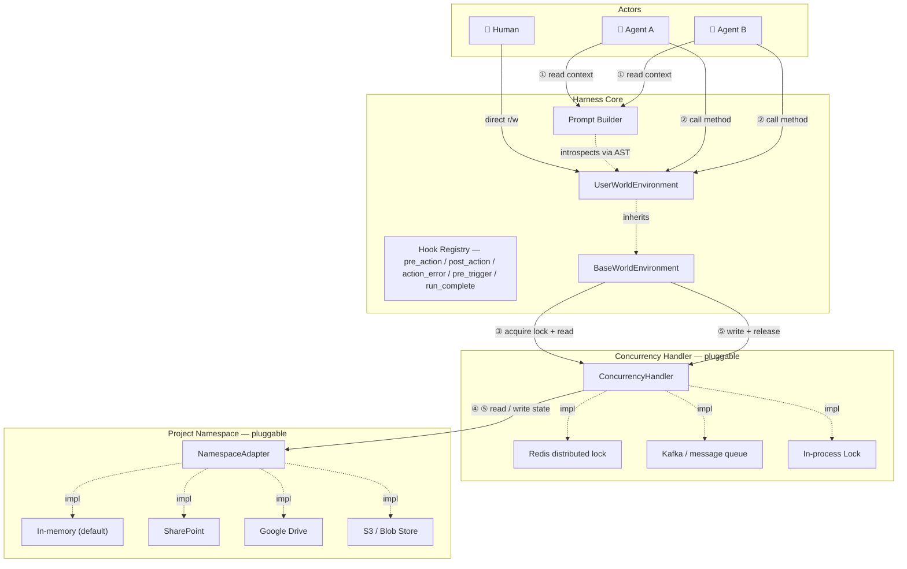

# Distributed Agent Harness

## Background

- Agent Harness pattern allows Agents to offload reasoning and complex tasks to intermediate memory files e.g. saving and updating summary documents or creating a list of tasks in an MD that they can then tick off
- 'Classic' Agent Harness must be adapted for handling business processes with the following changes:
- - Memory must be in a shared location i.e. not a file system
- - Multiple actors must be able to act on the memory. Could be different agents or different humans working on the same project simultaneously
- - Generic bash commands such as `ls` must be replaced with specific, controlled ways for the agent to manipulate its virtual environment. We need traceability and validation on each of the actions.

## Open Source Landscape

A survey of 10+ major agent frameworks (LangGraph, LlamaIndex, AutoGen, Microsoft Agent Framework, CrewAI, OpenAI Agents SDK, Haystack, Agno, MetaGPT, SmolAgents) shows that no single framework satisfies all three distributed harness requirements out of the box. The strongest candidates by requirement are:

- **Shared memory**: LangGraph's PostgreSQL/Redis checkpointer + `BaseStore` is the most production-tested design for cross-agent shared state
- **Concurrent actors**: LangGraph's `interrupt()` primitive is the best human-in-the-loop gate; true simultaneous multi-human writes require an event-sourcing layer above any existing framework
- **Controlled, auditable tools**: Microsoft Agent Framework (Semantic Kernel plugin model + kernel filters + Agent Governance Toolkit) offers the most complete open-source tool governance; MetaGPT's typed `Action` model is the closest conceptual match to replacing arbitrary bash commands

The recommended foundation is **LangGraph** (state/checkpoint infrastructure) combined with a **Semantic Kernel-style tool registry** and a custom append-only audit log. CrewAI, OpenAI Agents SDK, and SmolAgents are not viable foundations — they lack shared-memory and tool-governance primitives.

See [landscape.md](landscape.md) for the full framework-by-framework analysis and adaptation recommendations.

---

## System Design

### Architecture



**Call sequence for a single method invocation:**
1. At startup, the Prompt Builder introspects `UserWorldEnvironment` via AST and injects method signatures, docstrings, and source bodies into the LLM context window
2. The agent (or human) decides to invoke an action method on `UserWorldEnvironment`
3. `BaseWorldEnvironment` calls the Concurrency Handler: **acquire lock**, then **read latest state** from the Namespace into memory
4. The method executes against the freshly-loaded in-memory state
5. `BaseWorldEnvironment` calls the Concurrency Handler: **write new state** to the Namespace, then **release lock**

---

### Components

#### 1. Project Namespace *(pluggable long-term memory)*

The Project Namespace is the single source of truth for all project state. It is a document store organised by project — each document is a named, human-readable file (Markdown, YAML, or JSON). No binary serialization.

The `NamespaceAdapter` interface is minimal by design:

```python
class NamespaceAdapter:
    def read_doc(self, path: str) -> str: ...
    def write_doc(self, path: str, content: str) -> None: ...
    def list_docs(self) -> list[str]: ...
```

**Shipped adapters (v1):** `InMemoryNamespace` (default, for testing and local dev)
**Planned adapters:** SharePoint, Google Drive, S3 / Azure Blob

The in-memory adapter is the reference implementation. Any adapter that satisfies the interface can be swapped in without touching the rest of the harness.

##### Standard documents in every project namespace

Every project has the same four canonical documents, written and maintained by the harness automatically:

| Path | Purpose | Audience |
|---|---|---|
| `<project_id>/summary.md` | Narrative "card view" of the project — status, key entities, open items. Always lifted **in full** into the agent's system prompt. | Humans + agent |
| `<project_id>/event_log.md` | Append-only markdown history of every `@action` taken. The tail is lifted into the system prompt to prevent the agent from looping. | Humans + agent |
| `<project_id>/state.json` | Exact machine state (Pydantic-serialised). Lifted as raw JSON into the system prompt for precise tool-call arguments. | Agent + tooling |
| `<project_id>/audit.jsonl` | One-line-per-action machine audit log with timestamps, args, and outcomes. Mirror of `event_log.md` for programmatic queries. | Tooling |

The summary is generated by `render_summary()` on the WorldEnvironment — subclasses override it to produce domain-specific narrative output. See [`DataProtectionWorldEnvironment.render_summary()`](examples/data_protection/world.py) for a real example.

---

#### 2. World Environment *(the agent's view of the world)*

The World Environment is a Python class that an implementer writes for their specific domain. It has two layers:

**`BaseWorldEnvironment`** (provided by the harness) handles:
- Loading project state from the Namespace into a typed Python object on startup
- Persisting state changes back to the Namespace after every method call (via the Concurrency Handler)
- Wiring up the lock/read/write/release cycle transparently

**`UserWorldEnvironment`** (written by the implementer) contains:
- Domain-specific **state fields** — the attributes that represent what is true about the project right now
- Domain-specific **action methods** — the things an agent is allowed to do. These are the *only* operations an agent can perform. There are no free-form shell commands.

```python
class ProjectWorldEnvironment(BaseWorldEnvironment):
    # State — persisted to the namespace
    tasks: list[Task] = []
    decisions: list[Decision] = []

    def add_task(self, title: str, assignee: str) -> Task:
        """Create a new task and add it to the backlog."""
        ...

    def mark_complete(self, task_id: str) -> None:
        """Mark an existing task as done."""
        ...
```

Every public method on `UserWorldEnvironment` becomes one auditable agent action.

---

#### 3. Prompt Builder *(context injection)*

The Prompt Builder is responsible for making the World Environment legible to the LLM. Rather than providing only a tool-call interface (name + one-line description), it can progressively surface:

- **Function signature** — parameter names and types
- **Docstring** — the human-readable description
- **Source body** — the actual Python implementation, extracted via AST

Giving the LLM access to the source body means it can reason about second-order effects: it sees *how* a method will change the state, not just *what* it is named. This is a richer contract than standard MCP-style tool descriptions.

The Prompt Builder also injects the **current state** of the World Environment so the agent always acts on an accurate world snapshot.

---

#### 4. Lifecycle Hooks *(pluggable Python callables)*

Hooks are async Python callables that fire at well-defined points in the agent runtime. They are the harness equivalent of Claude Code's hooks — but in-process, typed, and async, since we don't need a serialisation boundary.

Five events are supported:

| Event | Fires | Can block? |
|---|---|---|
| `pre_action(action_name=None)` | Before an `@action` runs | **Yes** — return `BlockDecision(reason=...)` |
| `post_action(action_name=None)` | After an `@action` returns successfully | No |
| `action_error(action_name=None)` | When an `@action` raises | No |
| `pre_trigger` | When a `TriggerEvent` is received | **Yes** — blocks the whole run |
| `run_complete` | When an agent run finishes (any path) | No |

Hooks attached to a specific action name fire only for that action; hooks attached without a name (or with `None`) fire for every action. Specific hooks run before wildcard hooks so they can block first.

**Approval gate example:**

```python
from distributed_agent_harness import AgentRuntime, ActionContext, BlockDecision

runtime = AgentRuntime(...)

@runtime.on_pre_action("notify_ico")
async def require_partner_signoff(ctx: ActionContext) -> BlockDecision | None:
    if not await partner_approves(ctx.project_id, ctx.kwargs):
        return BlockDecision(reason="Awaiting partner sign-off before ICO notification")

@runtime.on_post_action("report_breach")
async def notify_partners_on_slack(ctx: ActionContext, result) -> None:
    await slack.post(
        channel="#data-protection",
        text=f"Breach reported on {ctx.project_id}: {result.description}",
    )

@runtime.on_action_error()  # fires for ANY action that raises
async def alert_oncall(ctx: ActionContext, exc: BaseException) -> None:
    await pagerduty.trigger(summary=f"{ctx.action_name} failed: {exc}")
```

A blocked action is surfaced to the LLM as a TOOL message containing the reason — the agent then has the opportunity to explain the block to the user or take a different action. Blocked triggers short-circuit the whole run with an ERROR event on the OutputChannel.

#### 5. Concurrency Handler *(pluggable distributed coordination)*

The Concurrency Handler sits between `BaseWorldEnvironment` and the Namespace. Its job is to ensure that concurrent method calls from multiple agents or humans do not corrupt the shared state.

The `ConcurrencyHandler` interface:

```python
class ConcurrencyHandler:
    def acquire_lock(self, namespace: str, timeout: float) -> None: ...
    def release_lock(self, namespace: str) -> None: ...
    def read_state(self, adapter: NamespaceAdapter) -> WorldState: ...
    def write_state(self, adapter: NamespaceAdapter, state: WorldState) -> None: ...
```

**Shipped adapters (v1):** `InProcessLock` (threading.Lock, single-machine)
**Planned adapters:** Redis distributed lock (multi-pod, same cluster), Kafka-based event log (full event sourcing)

The choice of adapter is a deployment concern, not an application concern. A team running everything in one Kubernetes namespace can use Redis; a team wanting full event history can use Kafka; a developer running locally uses the in-process lock.

---

### Requirements

#### Functional

| ID | Requirement |
|----|-------------|
| F1 | Multiple agents must be able to operate on the same Project Namespace concurrently without data corruption |
| F2 | Human actors must be able to read and write to the Project Namespace alongside agents |
| F3 | Every method invocation must be recorded with: caller identity, method name, parameters, timestamp, before/after state hash, and outcome — in an append-only audit log |
| F4 | The LLM must receive method signatures, docstrings, and optionally the source body for each action — not just a name |
| F5 | Project state must be human-readable at rest (Markdown / YAML / JSON); no binary serialization |
| F6 | The storage backend must be swappable at runtime by providing a different `NamespaceAdapter` — no changes to agent or environment code |
| F7 | The concurrency backend must be swappable by providing a different `ConcurrencyHandler` — no changes to agent or environment code |
| F8 | A new domain implementation requires writing exactly one Python class that inherits from `BaseWorldEnvironment` |
| F9 | No agent action may execute against a stale state snapshot — every call must read the latest state from the Namespace before executing |

#### Non-Functional

| ID | Requirement |
|----|-------------|
| N1 | The harness must be LLM-framework agnostic (no hard dependency on LangChain, OpenAI SDK, etc.) |
| N2 | The system must be fully runnable with zero cloud dependencies using `InMemoryNamespace` + `InProcessLock` |
| N3 | Arbitrary shell command execution must not be possible through the agent action interface |
| N4 | The base harness must ship with 100% test coverage on the lock/read/write/release cycle |

---

## Example Use Case: Data Protection Law Firm

### Context

Data protection law firms act as specialist advisors and outsourced Data Protection Officers (DPOs) for client organisations subject to the UK GDPR and Data Protection Act 2018. Their work spans the full compliance lifecycle — from winning a client through to managing the acute operational pressure of a data breach.

This is a rich example for a distributed agent harness because:
- The lifecycle has clearly defined **phases** with legal gates between them
- Multiple **concurrent actors** are natural: a partner, a trainee, and a compliance agent may all be working the same client file simultaneously
- Every action has **legal significance** and must be traceable — the ICO can audit the firm's records
- The underlying documents (contracts, privacy policies, breach logs) need to be **human-readable** so solicitors can review and sign off

### The Engagement Lifecycle

```
Pitch ──► Contract ──► Privacy Policy ──► [ Data Subject Requests ]
                                        └► [ Data Breaches        ]
```

#### 1. Pitch
The firm submits a proposal to win the data protection engagement. The pitch captures the prospective client's details, industry, and the scope of work (e.g. "full GDPR audit + ongoing DPO retainer"). The outcome is either `win_pitch()` (advancing to Contract) or `lose_pitch()` (closing the engagement).

#### 2. Contract
Once the pitch is won, a contract is agreed and a **Data Processing Agreement (DPA)** is included as standard under UK GDPR Art. 28. The contract records the retainer fee, terms summary, and review date.

#### 3. Privacy Policy
The law firm drafts a privacy policy for the client that documents:
- What **categories of personal data** are processed (e.g. names, email addresses, health data)
- The **purposes of processing** (e.g. payroll, marketing, fraud prevention)
- The **lawful basis** for each category (consent, contract, legitimate interests, etc.)
- **Retention periods** for each data category

The policy moves through `draft → approved (by a senior partner) → published` before it is live.

#### 4. Data Subject Requests (DSRs)
Under UK GDPR, individuals have the right to:
- **Erasure** ("right to be forgotten", Art. 17) — delete all data held
- **Access** (Subject Access Request, Art. 15) — receive a copy of all data held
- **Portability** (Art. 20) — receive data in a machine-readable format
- **Rectification** (Art. 16) — correct inaccurate data
- **Restriction** (Art. 18) — limit how their data is used

The law firm must respond **within 30 days** (UK GDPR Art. 12). The harness tracks: submission, acknowledgement, the 30-day deadline, completion or refusal (with documented exemptions).

#### 5. Data Breaches
When a personal data breach occurs the law firm must:
1. **Report** it internally as soon as discovered
2. **Assess** whether it is notifiable (i.e. likely to result in risk to individuals)
3. **Notify the ICO** within **72 hours** of discovery if notifiable (UK GDPR Art. 33)
4. **Notify affected data subjects** without undue delay if the breach poses a **high risk** to them (Art. 34)
5. **Resolve** the breach with documented remediation steps and lessons learned

The 72-hour clock is enforced by the harness — a warning is raised if `notify_ico()` is called after the window has closed.

### Mapping to the Harness

| Lifecycle phase | World state fields | Agent actions |
|---|---|---|
| Pitch / Contract | `status`, `client`, `contract` | `submit_pitch`, `win_pitch`, `lose_pitch` |
| Privacy Policy | `privacy_policies` | `draft_privacy_policy`, `approve_privacy_policy`, `publish_privacy_policy` |
| Data Subjects | `data_subjects` | `register_data_subject` |
| DSRs | `data_subject_requests` | `submit_dsr`, `acknowledge_dsr`, `complete_dsr`, `refuse_dsr` |
| Breach Management | `data_breaches` | `report_breach`, `assess_breach`, `notify_ico`, `notify_affected_subjects`, `resolve_breach` |

See [`examples/data_protection/`](examples/data_protection/) for the full implementation.
