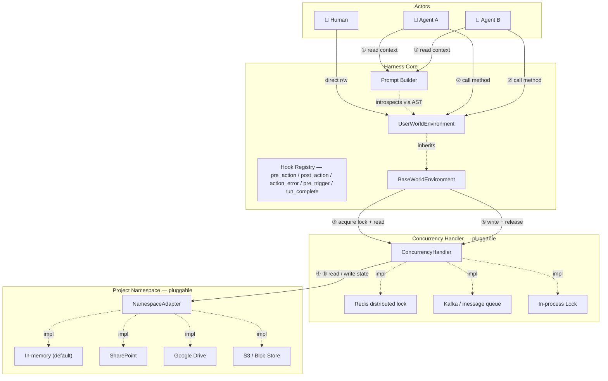

# Distributed Agent Harness

## Background

- Agent Harness pattern allows Agents to offload reasoning and complex tasks to intermediate memory files e.g. saving and updating summary documents or creating a list of tasks in an MD that they can then tick off
- 'Classic' Agent Harness must be adapted for handling business processes with the following changes:
- - Memory must be in a shared location i.e. not a file system
- - Multiple actors must be able to act on the memory. Could be different agents or different humans working on the same project simultaneously
- - Generic bash commands such as `ls` must be replaced with specific, controlled ways for the agent to manipulate its virtual environment. We need traceability and validation on each of the actions.

## Open Source Landscape

A survey of 10+ major agent frameworks (LangGraph, LlamaIndex, AutoGen, Microsoft Agent Framework, CrewAI, OpenAI Agents SDK, Haystack, Agno, MetaGPT, SmolAgents) shows that no single framework satisfies all three distributed harness requirements out of the box. The strongest candidates by requirement are:

- **Shared memory**: LangGraph's PostgreSQL/Redis checkpointer + `BaseStore` is the most production-tested design for cross-agent shared state
- **Concurrent actors**: LangGraph's `interrupt()` primitive is the best human-in-the-loop gate; true simultaneous multi-human writes require an event-sourcing layer above any existing framework
- **Controlled, auditable tools**: Microsoft Agent Framework (Semantic Kernel plugin model + kernel filters + Agent Governance Toolkit) offers the most complete open-source tool governance; MetaGPT's typed `Action` model is the closest conceptual match to replacing arbitrary bash commands

The recommended foundation is **LangGraph** (state/checkpoint infrastructure) combined with a **Semantic Kernel-style tool registry** and a custom append-only audit log. CrewAI, OpenAI Agents SDK, and SmolAgents are not viable foundations — they lack shared-memory and tool-governance primitives.

See [landscape.md](landscape.md) for the full framework-by-framework analysis and adaptation recommendations.

---

## System Design

### Architecture



**Call sequence for a single method invocation:**
1. At startup, the Prompt Builder introspects `UserWorldEnvironment` via AST and injects method signatures, docstrings, and source bodies into the LLM context window
2. The agent (or human) decides to invoke an action method on `UserWorldEnvironment`
3. `BaseWorldEnvironment` calls the Concurrency Handler: **acquire lock**, then **read latest state** from the Namespace into memory
4. The method executes against the freshly-loaded in-memory state
5. `BaseWorldEnvironment` calls the Concurrency Handler: **write new state** to the Namespace, then **release lock**

---

### Components

#### 1. Project Namespace *(pluggable long-term memory)*

The Project Namespace is the single source of truth for all project state. It is a document store organised by project — each document is a named, human-readable file (Markdown, YAML, or JSON). No binary serialization.

The `NamespaceAdapter` interface is minimal by design:

```python
class NamespaceAdapter:
    def read_doc(self, path: str) -> str: ...
    def write_doc(self, path: str, content: str) -> None: ...
    def list_docs(self) -> list[str]: ...
```

**Shipped adapters (v1):** `InMemoryNamespace` (default, for testing and local dev)
**Planned adapters:** SharePoint, Google Drive, S3 / Azure Blob

The in-memory adapter is the reference implementation. Any adapter that satisfies the interface can be swapped in without touching the rest of the harness.

##### Standard documents in every project namespace

Every project has the same four canonical documents, written and maintained by the harness automatically:

| Path | Purpose | Audience |
|---|---|---|
| `<project_id>/summary.md` | Narrative "card view" of the project — status, key entities, open items. Always lifted **in full** into the agent's system prompt. | Humans + agent |
| `<project_id>/event_log.md` | Append-only markdown history of every `@action` taken. The tail is lifted into the system prompt to prevent the agent from looping. | Humans + agent |
| `<project_id>/state.json` | Exact machine state (Pydantic-serialised). Lifted as raw JSON into the system prompt for precise tool-call arguments. | Agent + tooling |
| `<project_id>/audit.jsonl` | One-line-per-action machine audit log with timestamps, args, and outcomes. Mirror of `event_log.md` for programmatic queries. | Tooling |

The summary is generated by `render_summary()` on the WorldEnvironment — subclasses override it to produce domain-specific narrative output. See [`DataProtectionWorldEnvironment.render_summary()`](examples/data_protection/world.py) for a real example.

---

#### 2. World Environment *(the agent's view of the world)*

The World Environment is a Python class that an implementer writes for their specific domain. It has two layers:

**`BaseWorldEnvironment`** (provided by the harness) handles:
- Loading project state from the Namespace into a typed Python object on startup
- Persisting state changes back to the Namespace after every method call (via the Concurrency Handler)
- Wiring up the lock/read/write/release cycle transparently

**`UserWorldEnvironment`** (written by the implementer) contains:
- Domain-specific **state fields** — the attributes that represent what is true about the project right now
- Domain-specific **action methods** — the things an agent is allowed to do. These are the *only* operations an agent can perform. There are no free-form shell commands.

```python
class ProjectWorldEnvironment(BaseWorldEnvironment):
    # State — persisted to the namespace
    tasks: list[Task] = []
    decisions: list[Decision] = []

    def add_task(self, title: str, assignee: str) -> Task:
        """Create a new task and add it to the backlog."""
        ...

    def mark_complete(self, task_id: str) -> None:
        """Mark an existing task as done."""
        ...
```

Every public method on `UserWorldEnvironment` becomes one auditable agent action.

---

#### 3. Prompt Builder *(context injection)*

The Prompt Builder is responsible for making the World Environment legible to the LLM. Rather than providing only a tool-call interface (name + one-line description), it can progressively surface:

- **Function signature** — parameter names and types
- **Docstring** — the human-readable description
- **Source body** — the actual Python implementation, extracted via AST

Giving the LLM access to the source body means it can reason about second-order effects: it sees *how* a method will change the state, not just *what* it is named. This is a richer contract than standard MCP-style tool descriptions.

The Prompt Builder also injects the **current state** of the World Environment so the agent always acts on an accurate world snapshot.

---

#### 4. Action Discovery & Scaling *(precondition + relevance predicates)*

Every `@action` accepts two optional predicates that control how the action appears to the agent and whether it can run. Both have signature `(state, event) -> bool` where `event` is the triggering `TriggerEvent` (or `None` outside a runtime).

| Predicate | When false → | Use for |
|---|---|---|
| `precondition` | **Hidden** from the prompt *and* blocked at runtime with `PreconditionViolation` | Hard contracts: "this action cannot legitimately run in this state" |
| `relevance` | Demoted to the **Latent** prompt tier (manifest line only) | Soft hints: "this exists but is probably not what you want right now" |

Both predicates compose. They run against the freshly-hydrated state every iteration, so as the world changes the action partitioning updates automatically.

**Example — the full vocabulary on one action:**
```python
@action(
    # Hard contract: cannot run before contract is signed.
    precondition=lambda state, event: state.status == EngagementStatus.CONTRACTED,
    # Soft hint: only "active" when there's a notifiable unnotified breach.
    relevance=lambda state, event: any(
        b.is_notifiable and b.ico_notified_at is None
        for b in state.data_breaches
    ),
)
def notify_ico(self, breach_id: str, ...): ...
```

**Three prompt tiers, generated automatically:**

| Tier | Content per action | Triggered by |
|---|---|---|
| **Active** | Full signature + docstring + (optional) source | precondition true AND relevance true-or-unset |
| **Latent** | Manifest line: `name(params) — first line of docstring` | precondition true AND relevance is set but false |
| **Hidden** | (not shown to the model) | precondition is set and false |

The `PreconditionViolation` raised by a blocked action is caught by the `AgentRuntime` and surfaced to the LLM as a TOOL message with `blocked=True`, identical in shape to a blocked `pre_action` hook decision. The agent learns "I can't do this now" rather than crashing.

For very large action sets, future work will add `search_actions(query)` and `describe_action(name)` meta-actions to allow on-demand discovery of Latent actions. With current world sizes (~15 actions) the two-tier partitioning is sufficient.

#### 5. Lifecycle Hooks *(pluggable Python callables)*

Hooks are async Python callables that fire at well-defined points in the agent runtime. They are the harness equivalent of Claude Code's hooks — but in-process, typed, and async, since we don't need a serialisation boundary.

Five events are supported:

| Event | Fires | Can block? |
|---|---|---|
| `pre_action(action_name=None)` | Before an `@action` runs | **Yes** — return `BlockDecision(reason=...)` |
| `post_action(action_name=None)` | After an `@action` returns successfully | No |
| `action_error(action_name=None)` | When an `@action` raises | No |
| `pre_trigger` | When a `TriggerEvent` is received | **Yes** — blocks the whole run |
| `run_complete` | When an agent run finishes (any path) | No |

Hooks attached to a specific action name fire only for that action; hooks attached without a name (or with `None`) fire for every action. Specific hooks run before wildcard hooks so they can block first.

**Approval gate example:**

```python
from distributed_agent_harness import AgentRuntime, ActionContext, BlockDecision

runtime = AgentRuntime(...)

@runtime.on_pre_action("notify_ico")
async def require_partner_signoff(ctx: ActionContext) -> BlockDecision | None:
    if not await partner_approves(ctx.project_id, ctx.kwargs):
        return BlockDecision(reason="Awaiting partner sign-off before ICO notification")

@runtime.on_post_action("report_breach")
async def notify_partners_on_slack(ctx: ActionContext, result) -> None:
    await slack.post(
        channel="#data-protection",
        text=f"Breach reported on {ctx.project_id}: {result.description}",
    )

@runtime.on_action_error()  # fires for ANY action that raises
async def alert_oncall(ctx: ActionContext, exc: BaseException) -> None:
    await pagerduty.trigger(summary=f"{ctx.action_name} failed: {exc}")
```

A blocked action is surfaced to the LLM as a TOOL message containing the reason — the agent then has the opportunity to explain the block to the user or take a different action. Blocked triggers short-circuit the whole run with an ERROR event on the OutputChannel.

#### 6. Concurrency Handler *(pluggable distributed coordination)*

The Concurrency Handler sits between `BaseWorldEnvironment` and the Namespace. Its job is to ensure that concurrent method calls from multiple agents or humans do not corrupt the shared state.

The `ConcurrencyHandler` interface:

```python
class ConcurrencyHandler:
    def acquire_lock(self, namespace: str, timeout: float) -> None: ...
    def release_lock(self, namespace: str) -> None: ...
    def read_state(self, adapter: NamespaceAdapter) -> WorldState: ...
    def write_state(self, adapter: NamespaceAdapter, state: WorldState) -> None: ...
```

**Shipped adapters (v1):** `InProcessLock` (threading.Lock, single-machine)
**Planned adapters:** Redis distributed lock (multi-pod, same cluster), Kafka-based event log (full event sourcing)

The choice of adapter is a deployment concern, not an application concern. A team running everything in one Kubernetes namespace can use Redis; a team wanting full event history can use Kafka; a developer running locally uses the in-process lock.

---

### Requirements

#### Functional

| ID | Requirement |
|----|-------------|
| F1 | Multiple agents must be able to operate on the same Project Namespace concurrently without data corruption |
| F2 | Human actors must be able to read and write to the Project Namespace alongside agents |
| F3 | Every method invocation must be recorded with: caller identity, method name, parameters, timestamp, before/after state hash, and outcome — in an append-only audit log |
| F4 | The LLM must receive method signatures, docstrings, and optionally the source body for each action — not just a name |
| F5 | Project state must be human-readable at rest (Markdown / YAML / JSON); no binary serialization |
| F6 | The storage backend must be swappable at runtime by providing a different `NamespaceAdapter` — no changes to agent or environment code |
| F7 | The concurrency backend must be swappable by providing a different `ConcurrencyHandler` — no changes to agent or environment code |
| F8 | A new domain implementation requires writing exactly one Python class that inherits from `BaseWorldEnvironment` |
| F9 | No agent action may execute against a stale state snapshot — every call must read the latest state from the Namespace before executing |

#### Non-Functional

| ID | Requirement |
|----|-------------|
| N1 | The harness must be LLM-framework agnostic (no hard dependency on LangChain, OpenAI SDK, etc.) |
| N2 | The system must be fully runnable with zero cloud dependencies using `InMemoryNamespace` + `InProcessLock` |
| N3 | Arbitrary shell command execution must not be possible through the agent action interface |
| N4 | The base harness must ship with 100% test coverage on the lock/read/write/release cycle |

---

## Example Use Case: Data Protection Law Firm

### Context

Data protection law firms act as specialist advisors and outsourced Data Protection Officers (DPOs) for client organisations subject to the UK GDPR and Data Protection Act 2018. Their work spans the full compliance lifecycle — from winning a client through to managing the acute operational pressure of a data breach.

This is a rich example for a distributed agent harness because:
- The lifecycle has clearly defined **phases** with legal gates between them
- Multiple **concurrent actors** are natural: a partner, a trainee, and a compliance agent may all be working the same client file simultaneously
- Every action has **legal significance** and must be traceable — the ICO can audit the firm's records
- The underlying documents (contracts, privacy policies, breach logs) need to be **human-readable** so solicitors can review and sign off

### The Engagement Lifecycle

```
Pitch ──► Contract ──► Privacy Policy ──► [ Data Subject Requests ]
                                        └► [ Data Breaches        ]
```

#### 1. Pitch
The firm submits a proposal to win the data protection engagement. The pitch captures the prospective client's details, industry, and the scope of work (e.g. "full GDPR audit + ongoing DPO retainer"). The outcome is either `win_pitch()` (advancing to Contract) or `lose_pitch()` (closing the engagement).

#### 2. Contract
Once the pitch is won, a contract is agreed and a **Data Processing Agreement (DPA)** is included as standard under UK GDPR Art. 28. The contract records the retainer fee, terms summary, and review date.

#### 3. Privacy Policy
The law firm drafts a privacy policy for the client that documents:
- What **categories of personal data** are processed (e.g. names, email addresses, health data)
- The **purposes of processing** (e.g. payroll, marketing, fraud prevention)
- The **lawful basis** for each category (consent, contract, legitimate interests, etc.)
- **Retention periods** for each data category

The policy moves through `draft → approved (by a senior partner) → published` before it is live.

#### 4. Data Subject Requests (DSRs)
Under UK GDPR, individuals have the right to:
- **Erasure** ("right to be forgotten", Art. 17) — delete all data held
- **Access** (Subject Access Request, Art. 15) — receive a copy of all data held
- **Portability** (Art. 20) — receive data in a machine-readable format
- **Rectification** (Art. 16) — correct inaccurate data
- **Restriction** (Art. 18) — limit how their data is used

The law firm must respond **within 30 days** (UK GDPR Art. 12). The harness tracks: submission, acknowledgement, the 30-day deadline, completion or refusal (with documented exemptions).

#### 5. Data Breaches
When a personal data breach occurs the law firm must:
1. **Report** it internally as soon as discovered
2. **Assess** whether it is notifiable (i.e. likely to result in risk to individuals)
3. **Notify the ICO** within **72 hours** of discovery if notifiable (UK GDPR Art. 33)
4. **Notify affected data subjects** without undue delay if the breach poses a **high risk** to them (Art. 34)
5. **Resolve** the breach with documented remediation steps and lessons learned

The 72-hour clock is enforced by the harness — a warning is raised if `notify_ico()` is called after the window has closed.

### Mapping to the Harness

| Lifecycle phase | World state fields | Agent actions |
|---|---|---|
| Pitch / Contract | `status`, `client`, `contract` | `submit_pitch`, `win_pitch`, `lose_pitch` |
| Privacy Policy | `privacy_policies` | `draft_privacy_policy`, `approve_privacy_policy`, `publish_privacy_policy` |
| Data Subjects | `data_subjects` | `register_data_subject` |
| DSRs | `data_subject_requests` | `submit_dsr`, `acknowledge_dsr`, `complete_dsr`, `refuse_dsr` |
| Breach Management | `data_breaches` | `report_breach`, `assess_breach`, `notify_ico`, `notify_affected_subjects`, `resolve_breach` |

See [`examples/data_protection/`](examples/data_protection/) for the full implementation.

---

## Roadmap

Three planned pieces of work. Each item below is intentionally self-contained — file paths, class names, acceptance criteria, and open questions are written out so any contributor (or a fresh Claude Code thread) can pick one up without back-history.

| # | Title | Status | Depends on |
|---|---|---|---|
| 1 | Collapse `precondition` + `relevance` into one predicate, renamed `show_when` | Planned | — |
| 2 | A2A subagent support with pluggable agent registries | Planned | — |
| 3 | Drop `InProcessLock`; go all-in on event sourcing + agent-as-rebaser conflict resolution | Planned | (1) should land first so the predicate name in the new event-projection flow is stable |

---

### 1. Collapse predicates into a single `show_when`

**Status:** planned

**Goal:** replace the current two-predicate model (`precondition` for hard gating + `relevance` for soft hinting) with a single `show_when` predicate on `@action`. The action is shown to the LLM (and is callable) iff `show_when(state, event)` is True or `show_when` is not set. There is no more Active / Latent split.

**Why:** `show_when` is literal — it describes exactly what happens. The soft/hard distinction has produced no concrete use case that the single-predicate model can't handle by writing a slightly more lenient `show_when`. Collapsing to one knob removes a layer of cognitive load.

**Files to change:**

- `distributed_agent_harness/world.py`:
  - Replace `precondition` and `relevance` kwargs on `@action` with a single `show_when` kwarg. Same signature `(state, event) -> bool`. Same default (None = always show).
  - Rename the exception `PreconditionViolation` → `ActionNotAvailable` (the new name matches the new vocabulary; "precondition" no longer appears in the API).
  - On the wrapper, the stored attribute becomes `_show_when` (drop `_precondition`, `_relevance`).
  - The `Predicate` type alias stays; it's still `Callable[[BaseModel, TriggerEvent | None], bool]`.

- `distributed_agent_harness/prompt_builder.py`:
  - Delete the `_partition_actions` helper. There is no partitioning anymore.
  - `build_actions_prompt(world, event)` produces a single "Available Actions" section. An action appears iff its `_show_when` is None or returns True. Buggy predicates that raise are treated as False, defensively.
  - Remove the Latent-tier formatter `_format_action_manifest`.

- `distributed_agent_harness/runtime.py`:
  - The catch for `PreconditionViolation` becomes `ActionNotAvailable`. Same surfacing behaviour (`OutputEvent` payload with `blocked=True`, TOOL message back to LLM).

- `distributed_agent_harness/__init__.py`:
  - Replace `PreconditionViolation` export with `ActionNotAvailable`.

- `examples/data_protection/world.py`:
  - Every `precondition=` → `show_when=`.
  - Every `relevance=` → `show_when=`. Yes — the soft hints are promoted to hard gates. For this domain that is intentional and correct: there is no legitimate use case where the LLM should call `notify_ico` when no breach is outstanding, etc.

- `tests/test_predicates.py`:
  - Rename `TestPreconditionHardGate` → `TestShowWhen`. Update the API usage. Drop `TestRelevanceSoftHint` and `TestComposition` (no longer applicable).
  - Add a test confirming a hidden action is invisible in the prompt and uncallable (raises `ActionNotAvailable` when called directly).

- `tests/test_data_protection.py`:
  - The two tests matching `PreconditionViolation` should match `ActionNotAvailable`.

**Acceptance criteria:**

- `uv run pytest tests/` is green.
- `uv run python -m examples.data_protection.run` runs end-to-end.
- The system prompt has one "Available Actions" section, no Active/Latent partitioning.
- `grep -r "precondition\|relevance\|PreconditionViolation" distributed_agent_harness examples tests` returns nothing (except in the changelog/git history).

---

### 2. A2A subagent support with pluggable agent registries

**Status:** planned

**Goal:** allow the harness to invoke external agents via the A2A (Agent-to-Agent) protocol. Subagents are opaque external services — they don't know about the harness, they have their own conversation memory, they may live on different servers. All registered subagents speak A2A; no custom HTTP/JSON protocols are accepted in the codebase. Subagents are surfaced to the LLM as a separate category of tool, called via `consult_<name>(message)`.

**Why:** business processes need specialists (legal research, document drafting, classification) we don't want to implement inside the harness. A2A is the emerging open standard for agent-to-agent communication (Microsoft Agent Framework, Google ADK, etc. all adopt it). Locking to A2A keeps the abstraction tight.

**A2A primitives we use:**

- `AgentCard` — JSON descriptor: `name`, `description`, `url`, `skills`, `capabilities`, `authentication`. The unit of discovery and registration.
- `Task` — one unit of work; lifecycle `submitted → working → input-required → completed/failed`.
- `Message` + `Parts` — payload shape (text, structured data, files).
- `contextId` — session identifier; A2A's native conversation-continuity mechanism. Maps directly to our `session_id`.

**New module `distributed_agent_harness/subagents/`:**

- `subagents/base.py`:
  - `class SubagentClient(ABC)` with `name: str`, `description: str`, optional `show_when: Predicate | None` (consistent with item 1), and one method:
    ```python
    async def consult(
        self,
        message: str,
        session_id: str | None,
        context: dict[str, Any] | None = None,
    ) -> SubagentResponse: ...
    ```
  - `@dataclass SubagentResponse`: `content: str`, `session_id: str | None`, `metadata: dict`.
  - `class SubagentRegistry`: held on `AgentRuntime.subagents`. Methods: `register(client)`, `unregister(name)`, `list() -> list[SubagentClient]`, `get(name) -> SubagentClient`.

- `subagents/a2a.py`:
  - `class A2ASubagent(SubagentClient)` — speaks A2A over HTTP.
  - Constructor: `A2ASubagent(card: AgentCard, auth: Callable[[AgentCard], dict] | None = None, show_when: Predicate | None = None)`.
  - `consult()` implementation:
    1. Build an A2A task with the message and `contextId=session_id`.
    2. POST to `card.url` per the A2A spec.
    3. Stream task status via SSE; collect updates; resolve when state is `completed` or `failed`.
    4. Extract the final assistant message from the task's message history.
    5. Return `SubagentResponse(content=..., session_id=task.contextId, metadata={...})`.
  - Session persistence: store `session_id` per (project_id, subagent_name) at `<project>/subagents/<name>.session.json` via the project namespace adapter. Read on entry to `consult()`, write the response's `session_id` on success.

- `subagents/registry.py`:
  - `class AgentRegistry(ABC)`:
    ```python
    async def search(
        self,
        query: str | None = None,
        capabilities: list[str] | None = None,
        tags: list[str] | None = None,
        provider: str | None = None,
        max_cost_per_call: float | None = None,
        limit: int = 100,
    ) -> list[AgentCard]: ...

    async def get(self, agent_id: str) -> AgentCard: ...
    ```
  - `HttpAgentRegistry(AgentRegistry)` — talks to an A2A-compatible registry over HTTP.
  - `StaticAgentRegistry(AgentRegistry)` — list of `AgentCard`s held in code (for tests and small deployments).
  - Helper `async def load_subagents_from_registry(runtime, registry, **filters) -> list[A2ASubagent]` that searches, wraps each card, registers each on the runtime.

**Runtime integration:**

- `PromptBuilder` adds a new section after the action list:
  ```markdown
  ## Available Subagents (external specialists)

  ### `consult_legal_research(message: str) -> str`
  [card.description]
  Skills: [card.skills joined]
  Provider: [card.provider] · contextId persisted across calls.
  ```
  Only registered subagents whose `show_when` matches are shown (consistent with item 1).

- `AgentRuntime._execute_call`: when the LLM tool-calls `consult_<name>`, dispatch to the subagent registry rather than to `getattr(world, name)`. Otherwise the wrapping (audit log, hook firing, OutputEvent emission) is the same.

- Audit log line: `consult_legal_research(message='...') → '...' [session abc, 1.2s]`. Subagent calls show up in `event_log.md` alongside `@actions`.

- Hooks: add two new event kinds to `HookRegistry`: `pre_subagent_call(name=None)` and `post_subagent_call(name=None)`. Existing `pre_action` / `post_action` do NOT fire for subagents — different semantic category, different policies (e.g. cost ceilings).

**Dependencies:**

- An async A2A client library. If a maintained Python A2A client exists at implementation time, use it. Otherwise implement a minimal client over `httpx` + SSE following the A2A spec.

**Acceptance criteria:**

- Can register a subagent directly: `runtime.subagents.register(A2ASubagent(card))`.
- Can bulk-load via a registry: `await load_subagents_from_registry(runtime, registry, capabilities=["legal-research"])`.
- LLM can call `consult_<name>(message)`; response is returned as a TOOL message.
- Session persistence works across runs: second call to the same subagent sees the prior `contextId`.
- Audit log records every subagent call with timing and metadata.
- `pre_subagent_call` and `post_subagent_call` hooks fire correctly; `pre_action` and `post_action` do NOT fire for subagents.
- The codebase contains no non-A2A subagent client (no `HttpJsonSubagent`, no `OpenAIAssistantSubagent`, etc.).

**Open questions to resolve during implementation:**

- Auth: should `AgentCard.authentication` carry per-card credentials (simple but credentials in registry), or should the registry resolve auth on the caller's behalf and return pre-authenticated `Bearer` tokens?
- Cost ceiling: built-in per-run budget enforced via a default `pre_subagent_call` hook, or leave it to operators?
- A2A task streaming: surface `working → working → completed` updates to the OutputChannel as `OutputEventKind.THINKING` events for UX, or hide them?
- A `revise` decision (see item 3): a subagent response that says "I need more info" maps to A2A's `input-required` state. For v1 treat as an error; multi-turn task continuation is a future enhancement.

---

### 3. Drop `InProcessLock`; event sourcing + agent-as-rebaser

**Status:** planned (large refactor)

**Goal:** remove pessimistic locking from the harness entirely. Replace it with an event-sourced architecture where:

- Events (one per `@action` invocation) are the source of truth, stored in a totally-ordered append-only log per project.
- `state.json` becomes a derived projection — a cache, not the truth.
- Concurrent writes are optimistic: each append carries `expected_offset`. Conflicts (someone else appended first) are surfaced to the LLM as a structured "rebase" decision: continue, revise, restart, or abandon.

**Why:** locks don't compose across data centres, don't allow multi-actor parallelism on disjoint state, and leave the LLM unable to participate in conflict resolution. The agent-as-rebaser pattern is uniquely well-suited to LLMs — they are good at reading a list of intervening events and deciding whether their plan is still valid.

**Removals:**

- `distributed_agent_harness/concurrency.py` (ABC).
- `distributed_agent_harness/concurrency_handlers/` (the whole package).
- The `concurrency` constructor argument on `BaseWorldEnvironment` and `AgentRuntime`.
- The `acquire_lock` / `release_lock` pair around the `@action` wrapper body.
- The `ConcurrencyHandler` export from `__init__.py`.

**Additions:**

- `distributed_agent_harness/eventlog.py`:
  - `@dataclass Event`: `id: str`, `timestamp: datetime`, `project_id: str`, `action_name: str`, `args: list`, `kwargs: dict`, `actor: str` (`"agent" | "human" | "subagent:<name>"`), `result_summary: str | None`.
  - `class EventLog(ABC)`:
    ```python
    async def current_offset(self, project_id: str) -> int: ...
    async def append(self, project_id: str, event: Event, expected_offset: int) -> AppendResult: ...
    async def read_events(self, project_id: str, from_offset: int = 0) -> list[Event]: ...
    ```
  - `AppendResult` is either `Appended(new_offset: int)` or `Conflict(new_offset: int, intervening_events: list[Event])`.

- Built-in `EventLog` implementations:
  - `InMemoryEventLog` — used for tests and local dev. Implements the same optimistic-append semantics as Kafka (rejects appends whose `expected_offset` is stale).
  - `KafkaEventLog` — production. One Kafka topic; partition key = `project_id`. Transactional producer for idempotency; consumer for replay. Library choice (aiokafka vs confluent-kafka) is an open question.

- `distributed_agent_harness/conflict.py`:
  - `@dataclass ConflictContext`: `project_id`, `last_seen_offset`, `current_offset`, `intervening_events: list[Event]`, `planned_action: ToolCall`, `conversation_so_far: list[Message]`.
  - `class ConflictResolver(ABC)` with one method:
    ```python
    async def resolve(self, ctx: ConflictContext, llm: LLMProvider) -> Decision: ...
    ```
  - `Decision = Continue() | Revise(new_message: Message) | Restart() | Abandon(reason: str)`.
  - `class AgentDrivenConflictResolver(ConflictResolver)` — default. Calls the LLM with a structured prompt (see below) and parses one of four canonical responses.
  - `class AlwaysRestartResolver(ConflictResolver)` — simple fallback for low-trust environments or testing.

**`BaseWorldEnvironment` changes:**

- `@action` wrapper, new flow:
  1. Read `current_offset` from `EventLog`.
  2. Read events from `self._last_seen_offset` to current. Apply them to `self.state` to catch up.
  3. Run the wrapped method (mutates `self.state`).
  4. Construct an `Event` describing the call.
  5. `result = await eventlog.append(project_id, event, expected_offset=current_offset)`.
  6. If `Appended`, update `self._last_seen_offset` and return the method's return value.
  7. If `Conflict`, raise `ConcurrentUpdate(intervening_events=..., new_offset=...)` for the runtime to handle.

- State projection:
  - `_hydrate` is replaced by `_project_state_from_events`. Replays all events from offset 0 to current.
  - Optimisation: periodic snapshots of `state.json` keyed by offset. Hydrate = load snapshot at offset K + replay events from K to current.

**`AgentRuntime` changes:**

- Constructor takes `eventlog: EventLog` and `conflict_resolver: ConflictResolver | None = None` (defaults to `AgentDrivenConflictResolver`) instead of `concurrency`.
- In `_execute_call`, catch `ConcurrentUpdate` and route through the resolver:
  1. Emit `OutputEvent(kind=OutputEventKind.CONFLICT, payload={...})`.
  2. Call `resolver.resolve(ctx, llm)`.
  3. Act on the decision:
     - `Continue` — refresh `world._last_seen_offset`, re-issue the same tool call.
     - `Revise(message)` — drop any remaining queued tool calls in this turn; treat the LLM's revision as the new assistant message; continue the loop.
     - `Restart` — reset `conversation` to `[]`, re-enter the loop from the original `user_message` against the latest state.
     - `Abandon(reason)` — emit FINAL with the reason; exit the loop.

**Conflict-resolution prompt (used by `AgentDrivenConflictResolver`):**

```
## Concurrent State Change Detected

While you were planning, another actor updated the project state.
Your last seen offset: N.
Current offset: M.

Intervening events:
- offset N+1, by <actor> at <timestamp> — `<action>(args)`
- ...

Your originally planned next action:
  `<action>(<args>)`

Decide one of:
- `continue` — your plan is still valid; retry the action against the new state.
- `revise: <new plan in plain text>` — your plan needs updating.
- `restart` — too much has changed; start the agent run over.
- `abandon: <reason>` — stop and report back to the user.
```

**Idempotency requirements:**

- `@actions` must produce the same effect on replay. Audit all wall-clock usages (`datetime.now()`) and replace with the event's `timestamp` field (passed in via a context object) when running in replay mode.
- Add a test that asserts replay determinism: replaying a project's events from offset 0 produces a `state.json` identical to the live state at the latest offset.
- Generated IDs (`new_id()` in `models.py`) become a problem on replay — IDs must be deterministic. Two options: (a) derive from event id, (b) capture as part of the event payload, replay reads it back.

**Migration strategy:**

- The current `audit.jsonl` is structurally close to the new `Event`. The new `Event` shape mirrors it.
- `summary.md` and `event_log.md` continue to be generated as derived views of the event log on every flush.
- The data protection example continues to work — only the harness internals change.

**Acceptance criteria:**

- `concurrency.py` and `concurrency_handlers/` are gone from the codebase.
- All existing tests pass against `InMemoryEventLog`.
- `uv run python -m examples.data_protection.run` runs end-to-end.
- A scripted conflict-resolution test: two concurrent actions on the same project trigger the resolver, the test asserts the LLM was called with the conflict prompt and that each of the four decision branches works.
- Replay-determinism test: project state at latest offset is bit-identical to a state derived by replaying events from offset 0.

**Open questions to resolve during implementation:**

- Snapshot cadence and storage layout: every N events? On every flush? Where in the namespace?
- For `revise`, does the LLM's new plan execute immediately, or does the runtime first re-render the system prompt with the latest state and let the LLM re-decide?
- For `restart`, do we start fresh with the original `user_message`, or do we prepend a synthetic note ("you were interrupted by these events, please plan again")?
- Kafka client library: `aiokafka` (pure async) or `confluent-kafka` (more mature, sync wrapped in `to_thread`)?
- Can a conflict resolution itself conflict? (Second-order conflicts.) For v1: if the chosen `Continue` action also conflicts, escalate to `Restart` automatically.
