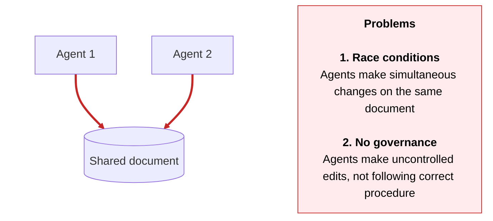
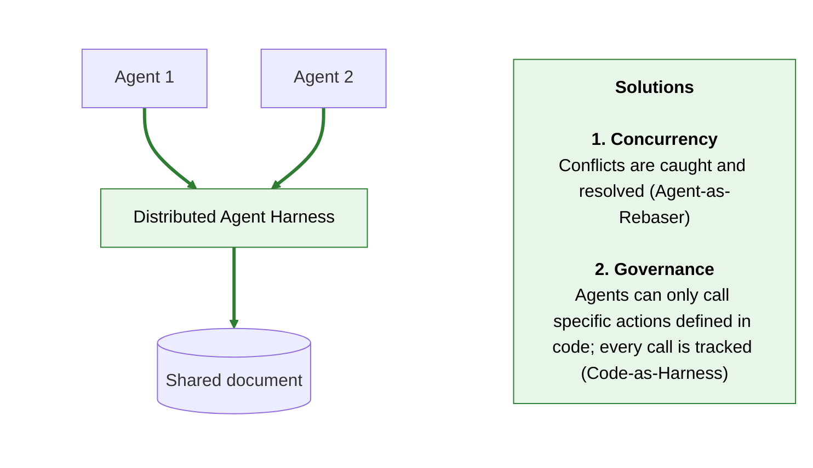

# Distributed Agent Harness

## What is this?

A framework for building **multi-actor agent systems that operate on shared business state**. Multiple humans and multiple agents collaborate on the same project concurrently.

Real business processes are **multi-stage and multiplayer** — they run over weeks or months and involve can involve many different actors (increasingly working alongside agents) at different stages. So they need a **shared memory space** — a single project state that every actor, human or agent, reads from and writes to.

The classic harness model — an LLM driving bash over a local filesystem (Claude Code, Cursor, …) — has turned out to be a remarkably good fit for *one* agent on *one* machine. But it breaks the moment you put multiple agents on the same shared state. Two of the ways it breaks, and how DAH fixes them:

#### Standard code harness with shared memory



#### With Distributed Agent Harness



## Quick start

The fastest way to try DAH is the bundled **web console** — a browser UI that runs against the example use cases in this repo. Pick one from the dropdown, send chat messages, and watch the agent reason, call typed actions, and update the project namespace.

### Prerequisites
- Python 3.11+
- [`uv`](https://docs.astral.sh/uv/) (or any other Python package manager)
- A Mistral API key — free tier works, get one at [console.mistral.ai](https://console.mistral.ai). You'll paste it into a local `.env` file in the next section; it never gets committed.

### Run it

```bash
# 1. Clone and install (including the optional `examples` dependency group)
git clone https://github.com/mcelearr/distributed-agent-harness
cd distributed-agent-harness
uv sync --group examples

# 2. Create your local .env from the template and fill in MISTRAL_API_KEY
cp .env.example .env
# …then open .env in your editor and paste in your key.

# 3. Launch the console, loading .env into the process
uv run --env-file .env python -m examples.interfaces.web_console
```

Then open [http://localhost:8765](http://localhost:8765). The dropdown lists the example use cases registered in [`examples/interfaces/web_console/worlds.toml`](examples/interfaces/web_console/worlds.toml) — today that's the Data Protection / GDPR example; adding more is a one-line config change.

## Why DAH

DAH is a positioning bet that there's a class of agent system — multi-actor, regulated, written by domain experts, deployed at company scale — that none of today's harnesses serve. Examples of similar platforms:

- **[Pi Coding Agent](https://pi.dev)** is a Claude Code-style terminal coding agent — a single user working a local repo, with `read` / `write` / `edit` / `bash` as default tools and TypeScript extensions for everything else.
- **[Microsoft Agent Framework (MAF)](https://github.com/microsoft/agent-framework)** is the production convergence of Semantic Kernel + AutoGen — a polyglot (Python + .NET) framework for graph-based workflows, durable execution, and Azure-hosted multi-agent systems.
- **[n8n](https://n8n.io)** is a fair-code workflow automation platform with a visual graph editor, 400+ integrations, and (since May 2026) first-class HITL approval gates on AI Agent tool calls.

The rest of this section walks the seven capabilities DAH is built around, then compares all four platforms across them. Where a competitor leads, it's called out.

### 1. Code-as-harness

Business logic is described in *code* — typed `@action` methods on a `WorldEnvironment` class — not natural-language tool descriptions. The LLM is given the method signature, docstring, **and the actual Python source body** (extracted via AST), so it can reason about *how* a call will mutate state, not just what it's named.

This is the central positioning bet: the right substrate for an LLM to reason about a regulated business process is code, not prose. Code carries semantic precision that a one-line tool description never can. LLMs already interpret code fluently; the next step is generating new `WorldEnvironment`s outright from a conversation with a domain expert.

### 2. Filesystem-as-virtual-environment — read freely, write through gates

Reads and writes are deliberately asymmetric:

- **Read** — LLMs have become very good at exploring filesystems with bash-style tools. We lean in: `ls`, `read`, `grep` over the project namespace are always-on meta-tools, including binary documents (PDFs, images). Same mental model as Claude Code.
- **Write** — every mutation goes through a typed `@action` declared by the implementer. No arbitrary edits. No shell escape hatch. Each call is appended to a tamper-evident event log with caller identity, arguments, and outcome.

### 3. Concurrent multi-actor writes, with the agent as conflict resolver

Multiple humans and multiple agents can write to the same project state simultaneously. Conflicts are resolved by **event sourcing + optimistic CAS**: when another actor has appended events under you, the runtime hands the LLM a structured prompt with the intervening events and lets it decide **Continue** (my plan is still valid), **Recover** (re-plan against the new state), or **Abandon**. A structural pre-check (`reads` / `writes` declared per action) auto-resolves disjoint conflicts without an LLM round-trip.

This is the architectural bet on concurrency: locks don't compose across data centres, and LLMs are uniquely well-suited to "read the diff and decide if my plan still survives."

### 4. Shared, human-readable memory

Project state lives in a swappable document store as Markdown / YAML / JSON. Never binary blobs. A human reviewer can open the project namespace directly — read `summary.md`, scan `event_log.md`, audit `state.json` — without tooling, training, or a vendor UI. The adapter interface is three methods; in-memory ships today, SharePoint / Drive / S3 are planned.

### 5. Vibe-code to production on the same code path

Non-technical and semi-technical builders (product owners, ops leads, analysts) increasingly describe what they want **to an AI**, in code, rather than dragging boxes around a no-code canvas. The historical trade-off was painful: no-code is accessible but a dead end (you outgrow the canvas, you lose git, you lose tests, you lose the debugger); real code is powerful but inaccessible.

DAH is the opinionated guardrail that makes vibe-coded business processes safe to ship. The builder describes their domain to their LLM; the LLM emits a `WorldEnvironment` subclass; the whole thing runs end-to-end in memory on a laptop, is unit-tested in pytest, is version-controlled in git — and the **same code** drops into a Kafka + SharePoint production deployment with no rewrites. The LLM isn't expected to generate the safe enterprise execution layer; DAH provides it.

### 6. Pluggable across every axis

| Concern | Interface | Shipped | Planned |
|---|---|---|---|
| Storage | `NamespaceAdapter` | `InMemoryNamespace` | SharePoint, Google Drive, S3 |
| Event log | `EventLog` | `InMemoryEventLog` | `KafkaEventLog` |
| Subagents | `SubagentClient` | A2A over HTTP+SSE, `AsyncSubagent`, `MessagingSubagent` | — |
| Message bus | `MessageBus` | `InMemoryMessageBus` | `KafkaMessageBus` |
| Conflict resolution | `ConflictResolver` | `AgentDrivenConflictResolver`, `AlwaysRecoverResolver` | — |
| LLM | none required (framework-agnostic) | — | — |

### 7. Zero cloud dependencies for local dev

The whole stack runs in-process. `InMemoryNamespace` + `InMemoryEventLog` is the default. The Kafka and SharePoint adapters are a *deployment concern*, not an application concern — changing them touches no domain code.

### How DAH compares

| Capability | DAH | PI | MAF | n8n |
|---|---|---|---|---|
| **1. Code-as-harness** (typed business logic; LLM sees source body) | **Yes** — `@action` methods on a `WorldEnvironment` class; AST extracts the method body and injects it into the system prompt alongside the typed signature. | **Partial** — tools are TypeBox-typed. No source-body injection; system prompt and instructions live in natural-language `SYSTEM.md` / `AGENTS.md`. | **Partial** — `FunctionTool` declares a Pydantic schema (and a YAML form for declarative agents). No AST source-body injection. | **No** — business logic is the visual graph itself. Inline JS / Python in node bodies is allowed but not the primary representation. |
| **2. Filesystem-as-VE — asymmetric read vs write** | **Yes (asymmetric)** — `ls` / `read` / `grep` are always-on read-only meta-tools (incl. binary docs); every mutation goes through a typed `@action`. No `bash` exists. | **Symmetric, ungated** — `read` / `write` / `edit` / `bash` are default tools. Permission gating is something you build with an extension; "no permission popups" is an explicit design stance. | **Symmetric, gated per tool** — `FileAccessProvider` exposes `save` / `read` / `delete` / `list` / `search` on a swappable `AgentFileStore`. `ApprovalMode="always_require"` can force HITL on any tool, but reads and writes are otherwise peers. | **N/A** — no virtual filesystem; file operations are individual nodes inside the graph. |
| **3. Concurrent multi-actor writes; agent as conflict resolver** | **Yes** — event-sourced log per project + optimistic CAS. On conflict the LLM sees the intervening events and chooses `Continue` / `Recover` / `Abandon`. A `reads`/`writes` pre-check auto-resolves disjoint conflicts. | **No** — single-user, single-process. Branching (`/tree`, `/fork`, `/clone`) is for one user's history, not multi-actor reconciliation. | **No** — workflow `State` uses superstep semantics with last-write-wins on commit; checkpoints support restart but not per-write CAS or LLM-driven rebase. | **No** — workflows are stateless by default. Cross-execution state requires an external DB; the platform does not surface conflicts to the agent. |
| **4. Shared human-readable memory in a swappable store** | **Yes** — every project has `summary.md`, `event_log.md`, `state.json`, `audit.jsonl`. `NamespaceAdapter` is a 3-method ABC; in-memory shipped, SharePoint / Drive / S3 planned. No binary serialisation. | **Per-developer local** — sessions are JSONL files in `~/.pi/agent/sessions/`. `AGENTS.md` is shared via the repo, but in-flight state is not cross-actor. | **Partial** — `MemoryContextProvider` writes a Claude-Code-style `MEMORY.md` + `topics/` + `transcripts/` and supports pluggable `MemoryStore` backends. Workflow checkpoint state is JSON, intended for restart not human review. | **No** — workflows are JSON-encoded graphs in the n8n DB; runtime state lives in the platform or external integrations and is not exposed as narratable documents. |
| **5. Vibe-code to production on the same code path** | **Yes** — same Python class runs in-process on a laptop with `InMemoryNamespace` + `InMemoryEventLog`, and in production against Kafka + SharePoint; only the adapter wiring changes. Git / pytest / debugger all work normally. | **N/A** — PI is itself the coding tool, not a deployment target. Pi-packages distribute extensions, not business logic. | **Partial** — declarative YAML agents and Python code both run locally and deploy to Foundry / Durable Functions in two lines. The assumed production target is Azure, and many features are Azure-flavoured. | **Opposite** — you can self-host or cloud-host what you built, but you're inside the n8n canvas: limited to its node taxonomy, locked into proprietary workflow JSON. Escaping into a regular repo with git / tests / debugger is not the path of least resistance — and is the trade-off DAH's positioning explicitly rejects. |
| **6. Pluggable across every axis** | **Yes, by design** — `NamespaceAdapter`, `EventLog`, `SubagentClient`, `MessageBus`, `ConflictResolver` are all ABCs. LLM is framework-agnostic. | **Strong on UX; thin on infra** — TypeScript Extensions, Skills, Prompts, Themes, custom providers, MCP via extension. Storage is local disk, not abstracted. | **Strong** — many provider integrations (Azure / OpenAI / Anthropic / Gemini / Bedrock / Ollama / …), pluggable checkpointing, file stores, history providers, memory stores, A2A, MCP. Polyglot (Py + .NET). | **Strong in node sense** — 400+ pre-built integrations + JS/Python in-node. You cannot swap the executor or the workflow-graph representation itself. |
| **7. Zero cloud dependencies for local dev** | **Yes** — `InMemory*` defaults; the full stack runs in-process. | **Yes** — local-only by default; the only external dep is the LLM API. | **Mostly** — in-memory stores + a local provider (e.g. Ollama) work cloud-free. DevUI / Foundry hosting / Azure features are the cloud-flavoured surfaces. | **Yes** — self-host via Docker; runs entirely offline if your nodes don't reach external APIs. |

### Where each competitor leads

- **PI** is the cleanest and most extensible single-user coding-agent harness in the field. If your goal is a terminal coding agent customised to one developer's workflow, DAH is the wrong shape — pick PI.
- **MAF** is the strongest platform for **production multi-agent workflows on Azure**, with built-in HITL via `ApprovalMode`, graph-based orchestration patterns (sequential / concurrent / handoff / group), durable execution, A2A and MCP, and a polyglot story. If your team already lives in the Microsoft ecosystem and you don't need multi-human concurrent writes on the same state, MAF is probably a better fit.
- **n8n** is the strongest **operator-facing** automation platform in the field. If your domain experts are happy describing their work as a visual graph and you don't need to escape into a regular code repo, n8n's 400+ integrations and tool-level HITL approval gates will get you to production faster than anything else.

### Where DAH leads

- **Code-as-harness with AST source-body injection.** No competitor injects the Python source of an action into the LLM's context. The bet is that an LLM can reason about second-order effects more precisely from code than from a one-line tool description.
- **Genuinely concurrent multi-actor writes with the agent as conflict resolver.** Every other platform on this list assumes a single primary actor on a piece of state at a time. DAH treats the LLM as a first-class participant in conflict resolution — a pattern that becomes more compelling as model capability grows.
- **Asymmetric filesystem semantics — read freely, write through gates.** PI gives the LLM `bash`; n8n hides the filesystem entirely; MAF has uniform tool-level gating. DAH is the only one explicitly betting that LLMs are good at *reading* filesystems and that *writing* needs to be locked down.
- **Vibe-code-to-production without leaving normal code.** MAF and n8n both expose deployment paths to managed infra, but DAH is the only one where the *same Python class* runs unchanged from `InMemoryEventLog` to `KafkaEventLog` with full git / pytest / debugger leverage along the way.

---

## System Design

### Components

#### 1. Project Namespace *(pluggable long-term memory)*

The Project Namespace is the single source of truth for all project state. It is a document store organised by project — each document is a named, human-readable file (Markdown, YAML, or JSON). No binary serialization.

The `NamespaceAdapter` interface is minimal by design:

```python
class NamespaceAdapter:
    def read_doc(self, path: str) -> str: ...
    def write_doc(self, path: str, content: str) -> None: ...
    def list_docs(self) -> list[str]: ...
```

**Shipped adapters (v1):** `InMemoryNamespace` (default, for testing and local dev)
**Planned adapters:** SharePoint, Google Drive, S3 / Azure Blob

The in-memory adapter is the reference implementation. Any adapter that satisfies the interface can be swapped in without touching the rest of the harness.

##### Standard documents in every project namespace

Every project has the same four canonical documents, written and maintained by the harness automatically:

| Path | Purpose | Audience |
|---|---|---|
| `<project_id>/summary.md` | Narrative "card view" of the project — status, key entities, open items. Always lifted **in full** into the agent's system prompt. | Humans + agent |
| `<project_id>/event_log.md` | Append-only markdown history of every `@action` taken. The tail is lifted into the system prompt to prevent the agent from looping. | Humans + agent |
| `<project_id>/state.json` | Exact machine state (Pydantic-serialised). Lifted as raw JSON into the system prompt for precise tool-call arguments. | Agent + tooling |
| `<project_id>/audit.jsonl` | One-line-per-action machine audit log with timestamps, args, and outcomes. Mirror of `event_log.md` for programmatic queries. | Tooling |

The summary is generated by `render_summary()` on the WorldEnvironment — subclasses override it to produce domain-specific narrative output. See [`DataProtectionWorldEnvironment.render_summary()`](examples/use_cases/data_protection/world.py) for a real example.

---

#### 2. World Environment *(the agent's view of the world)*

The World Environment is a Python class that an implementer writes for their specific domain. It has two layers:

**`BaseWorldEnvironment`** (provided by the harness) handles:
- Loading project state from the Namespace into a typed Python object on startup
- Persisting state changes back to the Namespace after every `@action` call
- Appending every call to the event log and detecting conflicts via optimistic CAS

**`UserWorldEnvironment`** (written by the implementer) contains:
- Domain-specific **state fields** — the attributes that represent what is true about the project right now
- Domain-specific **action methods** — the things an agent is allowed to do. These are the *only* operations an agent can perform. There are no free-form shell commands.

```python
class ProjectWorldEnvironment(BaseWorldEnvironment):
    # State — persisted to the namespace
    tasks: list[Task] = []
    decisions: list[Decision] = []

    def add_task(self, title: str, assignee: str) -> Task:
        """Create a new task and add it to the backlog."""
        ...

    def mark_complete(self, task_id: str) -> None:
        """Mark an existing task as done."""
        ...
```

Every public method on `UserWorldEnvironment` becomes one auditable agent action.

---

#### 3. Prompt Builder *(context injection)*

The Prompt Builder is responsible for making the World Environment legible to the LLM. Rather than providing only a tool-call interface (name + one-line description), it can progressively surface:

- **Function signature** — parameter names and types
- **Docstring** — the human-readable description
- **Source body** — the actual Python implementation, extracted via AST

Giving the LLM access to the source body means it can reason about second-order effects: it sees *how* a method will change the state, not just *what* it is named. This is a richer contract than standard MCP-style tool descriptions.

The Prompt Builder also injects the **current state** of the World Environment so the agent always acts on an accurate world snapshot.

---

#### 4. Action Discovery & Scaling *(the `show_when` predicate)*

Every `@action` accepts an optional `show_when` predicate with signature `(state, event) -> bool` (where `event` is the triggering `TriggerEvent`, or `None` outside a runtime). The action is shown to the LLM — and is callable — iff `show_when` is unset or returns True against the current state. When it returns False (or raises), the action is hidden from the prompt entirely and any direct invocation raises `ActionNotAvailable`.

`show_when` runs against the freshly-hydrated state every iteration, so the action set the LLM sees updates automatically as the world changes.

**Example:**
```python
@action(
    show_when=lambda state, event: any(
        b.is_notifiable and b.ico_notified_at is None
        for b in state.data_breaches
    ),
)
def notify_ico(self, breach_id: str, ...): ...
```

`ActionNotAvailable` is caught by the `AgentRuntime` and surfaced to the LLM as a TOOL message with `blocked=True` — identical in shape to a blocked `pre_action` hook decision. The agent learns "I can't do this now" rather than crashing.

For very large action sets, future work will add `search_actions(query)` and `describe_action(name)` meta-actions for on-demand discovery. With current world sizes (~15 actions) the binary visible/hidden split is sufficient.

#### 5. Lifecycle Hooks *(pluggable Python callables)*

Hooks are async Python callables that fire at well-defined points in the agent runtime. They are the harness equivalent of Claude Code's hooks — but in-process, typed, and async, since we don't need a serialisation boundary.

Five events are supported:

| Event | Fires | Can block? |
|---|---|---|
| `pre_action(action_name=None)` | Before an `@action` runs | **Yes** — return `BlockDecision(reason=...)` |
| `post_action(action_name=None)` | After an `@action` returns successfully | No |
| `action_error(action_name=None)` | When an `@action` raises | No |
| `pre_trigger` | When a `TriggerEvent` is received | **Yes** — blocks the whole run |
| `run_complete` | When an agent run finishes (any path) | No |

Hooks attached to a specific action name fire only for that action; hooks attached without a name (or with `None`) fire for every action. Specific hooks run before wildcard hooks so they can block first.

**Approval gate example:**

```python
from distributed_agent_harness import AgentRuntime, ActionContext, BlockDecision

runtime = AgentRuntime(...)

@runtime.on_pre_action("notify_ico")
async def require_partner_signoff(ctx: ActionContext) -> BlockDecision | None:
    if not await partner_approves(ctx.project_id, ctx.kwargs):
        return BlockDecision(reason="Awaiting partner sign-off before ICO notification")

@runtime.on_post_action("report_breach")
async def notify_partners_on_slack(ctx: ActionContext, result) -> None:
    await slack.post(
        channel="#data-protection",
        text=f"Breach reported on {ctx.project_id}: {result.description}",
    )

@runtime.on_action_error()  # fires for ANY action that raises
async def alert_oncall(ctx: ActionContext, exc: BaseException) -> None:
    await pagerduty.trigger(summary=f"{ctx.action_name} failed: {exc}")
```

A blocked action is surfaced to the LLM as a TOOL message containing the reason — the agent then has the opportunity to explain the block to the user or take a different action. Blocked triggers short-circuit the whole run with an ERROR event on the OutputChannel.

#### 6. Concurrency model *(event sourcing + optimistic CAS + agent-driven resolution)*

DAH does **not** use locks. Concurrent writes are coordinated through an append-only event log plus optimistic compare-and-swap. The design assumption is that locks don't compose across data centres, but LLMs are well-suited to "read the diff and decide if my plan still survives."

**The mechanism, per `@action` call:**

1. On entry the action records the current end-of-log offset as its "last seen" position.
2. The action executes against in-memory state.
3. On exit the action tries to append its `Event` with that offset as a CAS token. If the log has advanced — i.e. another actor appended in between — the append fails with `ConcurrentUpdate` and the runtime invokes the `ConflictResolver`.

The resolver sees a `ConflictContext` carrying the intervening events plus the planned tool call, and returns one of:

| Decision | Meaning |
|---|---|
| `Continue` | The plan is still valid against the new state — retry the same call. |
| `Recover` | The plan is stale — rebuild the system prompt with fresh state and let the LLM re-plan. The conversation is preserved; only the next assistant turn is regenerated. |
| `Abandon(reason)` | Stop the run and report back to the user. |

```python
class ConflictResolver(ABC):
    async def resolve(
        self,
        ctx: ConflictContext,
        llm: LLMProvider | None = None,
    ) -> Decision: ...
```

**Shipped resolvers:**
- `AgentDrivenConflictResolver` *(default)* — asks the LLM to choose `Continue` / `Recover` / `Abandon`, given the intervening events and the planned action.
- `AlwaysRecoverResolver` — safe deterministic default for low-trust environments and tests; never consults the LLM.

**Structural pre-check.** Before invoking the resolver the runtime checks whether the planned action's declared `reads` / `writes` fields are disjoint from the writes of the intervening events. If they are, the conflict is materially harmless and the runtime auto-`Continue`s without an LLM round-trip. This is the cheap fast-path that keeps the common "two actors editing unrelated parts of the same project" case lock-free *and* LLM-free.

**Persistence is pluggable too.** The append-only log itself sits behind an `EventLog` ABC. `InMemoryEventLog` ships and runs locally; `KafkaEventLog` is the planned production backend. The application code is identical in either deployment.

---

### Requirements

#### Functional

| ID | Requirement |
|----|-------------|
| F1 | Multiple agents must be able to operate on the same Project Namespace concurrently without data corruption |
| F2 | Human actors must be able to read and write to the Project Namespace alongside agents |
| F3 | Every `@action` invocation must be recorded in an append-only audit log with: actor identity, method name, parameters, timestamp, log offset, and outcome (result type or error) |
| F4 | The LLM must receive method signatures, docstrings, and optionally the source body for each action — not just a name |
| F5 | Project state must be human-readable at rest (Markdown / YAML / JSON); no binary serialization |
| F6 | The storage backend must be swappable at runtime by providing a different `NamespaceAdapter` — no changes to agent or environment code |
| F7 | The conflict-resolution policy must be swappable by providing a different `ConflictResolver`, and the persistence backend by providing a different `EventLog` — no changes to agent or environment code |
| F8 | A new domain implementation requires writing exactly one Python class that inherits from `BaseWorldEnvironment` |
| F9 | No agent action may commit against a stale state snapshot — every successful append must win the optimistic-CAS check on the current event-log offset |

#### Non-Functional

| ID | Requirement |
|----|-------------|
| N1 | The harness must be LLM-framework agnostic (no hard dependency on LangChain, OpenAI SDK, etc.) |
| N2 | The system must be fully runnable with zero cloud dependencies using `InMemoryNamespace` + `InMemoryEventLog` |
| N3 | Arbitrary shell command execution must not be possible through the agent action interface |
| N4 | The base harness must ship with comprehensive test coverage on the event-sourcing / conflict-resolution cycle (CAS append, `ConcurrentUpdate`, `Continue` / `Recover` / `Abandon` decisions, structural pre-check) |

---

## Example Use Case: Data Protection Law Firm

### Context

Data protection law firms act as specialist advisors and outsourced Data Protection Officers (DPOs) for client organisations subject to the UK GDPR and Data Protection Act 2018. Their work spans the full compliance lifecycle — from winning a client through to managing the acute operational pressure of a data breach.

This is a rich example for a distributed agent harness because:
- The lifecycle has clearly defined **phases** with legal gates between them
- Multiple **concurrent actors** are natural: a partner, a trainee, and a compliance agent may all be working the same client file simultaneously
- Every action has **legal significance** and must be traceable — the ICO can audit the firm's records
- The underlying documents (contracts, privacy policies, breach logs) need to be **human-readable** so solicitors can review and sign off

### The Engagement Lifecycle

```
Pitch ──► Contract ──► Privacy Policy ──► [ Data Subject Requests ]
                                        └► [ Data Breaches        ]
```

#### 1. Pitch
The firm submits a proposal to win the data protection engagement. The pitch captures the prospective client's details, industry, and the scope of work (e.g. "full GDPR audit + ongoing DPO retainer"). The outcome is either `win_pitch()` (advancing to Contract) or `lose_pitch()` (closing the engagement).

#### 2. Contract
Once the pitch is won, a contract is agreed and a **Data Processing Agreement (DPA)** is included as standard under UK GDPR Art. 28. The contract records the retainer fee, terms summary, and review date.

#### 3. Privacy Policy
The law firm drafts a privacy policy for the client that documents:
- What **categories of personal data** are processed (e.g. names, email addresses, health data)
- The **purposes of processing** (e.g. payroll, marketing, fraud prevention)
- The **lawful basis** for each category (consent, contract, legitimate interests, etc.)
- **Retention periods** for each data category

The policy moves through `draft → approved (by a senior partner) → published` before it is live.

#### 4. Data Subject Requests (DSRs)
Under UK GDPR, individuals have the right to:
- **Erasure** ("right to be forgotten", Art. 17) — delete all data held
- **Access** (Subject Access Request, Art. 15) — receive a copy of all data held
- **Portability** (Art. 20) — receive data in a machine-readable format
- **Rectification** (Art. 16) — correct inaccurate data
- **Restriction** (Art. 18) — limit how their data is used

The law firm must respond **within 30 days** (UK GDPR Art. 12). The harness tracks: submission, acknowledgement, the 30-day deadline, completion or refusal (with documented exemptions).

#### 5. Data Breaches
When a personal data breach occurs the law firm must:
1. **Report** it internally as soon as discovered
2. **Assess** whether it is notifiable (i.e. likely to result in risk to individuals)
3. **Notify the ICO** within **72 hours** of discovery if notifiable (UK GDPR Art. 33)
4. **Notify affected data subjects** without undue delay if the breach poses a **high risk** to them (Art. 34)
5. **Resolve** the breach with documented remediation steps and lessons learned

The 72-hour clock is enforced by the harness — a warning is raised if `notify_ico()` is called after the window has closed.

### Mapping to the Harness

| Lifecycle phase | World state fields | Agent actions |
|---|---|---|
| Pitch / Contract | `status`, `client`, `contract` | `submit_pitch`, `win_pitch`, `lose_pitch` |
| Privacy Policy | `privacy_policies` | `draft_privacy_policy`, `approve_privacy_policy`, `publish_privacy_policy` |
| Data Subjects | `data_subjects` | `register_data_subject` |
| DSRs | `data_subject_requests` | `submit_dsr`, `acknowledge_dsr`, `complete_dsr`, `refuse_dsr` |
| Breach Management | `data_breaches` | `report_breach`, `assess_breach`, `notify_ico`, `notify_affected_subjects`, `resolve_breach` |

See [`examples/use_cases/data_protection/`](examples/use_cases/data_protection/) for the full implementation.
