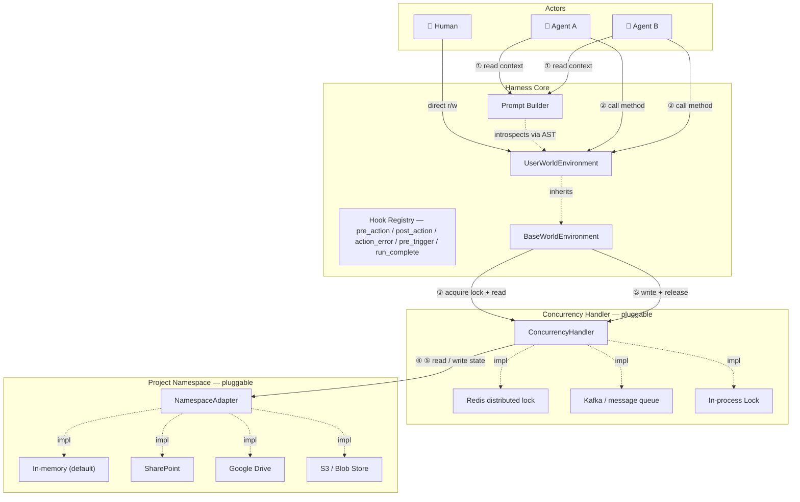

# Distributed Agent Harness

## Background

- Agent Harness pattern allows Agents to offload reasoning and complex tasks to intermediate memory files e.g. saving and updating summary documents or creating a list of tasks in an MD that they can then tick off
- 'Classic' Agent Harness must be adapted for handling business processes with the following changes:
- - Memory must be in a shared location i.e. not a file system
- - Multiple actors must be able to act on the memory. Could be different agents or different humans working on the same project simultaneously
- - Generic bash commands such as `ls` must be replaced with specific, controlled ways for the agent to manipulate its virtual environment. We need traceability and validation on each of the actions.

## Open Source Landscape

A survey of 10+ major agent frameworks (LangGraph, LlamaIndex, AutoGen, Microsoft Agent Framework, CrewAI, OpenAI Agents SDK, Haystack, Agno, MetaGPT, SmolAgents) shows that no single framework satisfies all three distributed harness requirements out of the box. The strongest candidates by requirement are:

- **Shared memory**: LangGraph's PostgreSQL/Redis checkpointer + `BaseStore` is the most production-tested design for cross-agent shared state
- **Concurrent actors**: LangGraph's `interrupt()` primitive is the best human-in-the-loop gate; true simultaneous multi-human writes require an event-sourcing layer above any existing framework
- **Controlled, auditable tools**: Microsoft Agent Framework (Semantic Kernel plugin model + kernel filters + Agent Governance Toolkit) offers the most complete open-source tool governance; MetaGPT's typed `Action` model is the closest conceptual match to replacing arbitrary bash commands

The recommended foundation is **LangGraph** (state/checkpoint infrastructure) combined with a **Semantic Kernel-style tool registry** and a custom append-only audit log. CrewAI, OpenAI Agents SDK, and SmolAgents are not viable foundations — they lack shared-memory and tool-governance primitives.

See [landscape.md](landscape.md) for the full framework-by-framework analysis and adaptation recommendations.

---

## System Design

### Architecture



**Call sequence for a single method invocation:**
1. At startup, the Prompt Builder introspects `UserWorldEnvironment` via AST and injects method signatures, docstrings, and source bodies into the LLM context window
2. The agent (or human) decides to invoke an action method on `UserWorldEnvironment`
3. `BaseWorldEnvironment` calls the Concurrency Handler: **acquire lock**, then **read latest state** from the Namespace into memory
4. The method executes against the freshly-loaded in-memory state
5. `BaseWorldEnvironment` calls the Concurrency Handler: **write new state** to the Namespace, then **release lock**

---

### Components

#### 1. Project Namespace *(pluggable long-term memory)*

The Project Namespace is the single source of truth for all project state. It is a document store organised by project — each document is a named, human-readable file (Markdown, YAML, or JSON). No binary serialization.

The `NamespaceAdapter` interface is minimal by design:

```python
class NamespaceAdapter:
    def read_doc(self, path: str) -> str: ...
    def write_doc(self, path: str, content: str) -> None: ...
    def list_docs(self) -> list[str]: ...
```

**Shipped adapters (v1):** `InMemoryNamespace` (default, for testing and local dev)
**Planned adapters:** SharePoint, Google Drive, S3 / Azure Blob

The in-memory adapter is the reference implementation. Any adapter that satisfies the interface can be swapped in without touching the rest of the harness.

##### Standard documents in every project namespace

Every project has the same four canonical documents, written and maintained by the harness automatically:

| Path | Purpose | Audience |
|---|---|---|
| `<project_id>/summary.md` | Narrative "card view" of the project — status, key entities, open items. Always lifted **in full** into the agent's system prompt. | Humans + agent |
| `<project_id>/event_log.md` | Append-only markdown history of every `@action` taken. The tail is lifted into the system prompt to prevent the agent from looping. | Humans + agent |
| `<project_id>/state.json` | Exact machine state (Pydantic-serialised). Lifted as raw JSON into the system prompt for precise tool-call arguments. | Agent + tooling |
| `<project_id>/audit.jsonl` | One-line-per-action machine audit log with timestamps, args, and outcomes. Mirror of `event_log.md` for programmatic queries. | Tooling |

The summary is generated by `render_summary()` on the WorldEnvironment — subclasses override it to produce domain-specific narrative output. See [`DataProtectionWorldEnvironment.render_summary()`](examples/data_protection/world.py) for a real example.

---

#### 2. World Environment *(the agent's view of the world)*

The World Environment is a Python class that an implementer writes for their specific domain. It has two layers:

**`BaseWorldEnvironment`** (provided by the harness) handles:
- Loading project state from the Namespace into a typed Python object on startup
- Persisting state changes back to the Namespace after every method call (via the Concurrency Handler)
- Wiring up the lock/read/write/release cycle transparently

**`UserWorldEnvironment`** (written by the implementer) contains:
- Domain-specific **state fields** — the attributes that represent what is true about the project right now
- Domain-specific **action methods** — the things an agent is allowed to do. These are the *only* operations an agent can perform. There are no free-form shell commands.

```python
class ProjectWorldEnvironment(BaseWorldEnvironment):
    # State — persisted to the namespace
    tasks: list[Task] = []
    decisions: list[Decision] = []

    def add_task(self, title: str, assignee: str) -> Task:
        """Create a new task and add it to the backlog."""
        ...

    def mark_complete(self, task_id: str) -> None:
        """Mark an existing task as done."""
        ...
```

Every public method on `UserWorldEnvironment` becomes one auditable agent action.

---

#### 3. Prompt Builder *(context injection)*

The Prompt Builder is responsible for making the World Environment legible to the LLM. Rather than providing only a tool-call interface (name + one-line description), it can progressively surface:

- **Function signature** — parameter names and types
- **Docstring** — the human-readable description
- **Source body** — the actual Python implementation, extracted via AST

Giving the LLM access to the source body means it can reason about second-order effects: it sees *how* a method will change the state, not just *what* it is named. This is a richer contract than standard MCP-style tool descriptions.

The Prompt Builder also injects the **current state** of the World Environment so the agent always acts on an accurate world snapshot.

---

#### 4. Action Discovery & Scaling *(the `show_when` predicate)*

Every `@action` accepts an optional `show_when` predicate with signature `(state, event) -> bool` (where `event` is the triggering `TriggerEvent`, or `None` outside a runtime). The action is shown to the LLM — and is callable — iff `show_when` is unset or returns True against the current state. When it returns False (or raises), the action is hidden from the prompt entirely and any direct invocation raises `ActionNotAvailable`.

`show_when` runs against the freshly-hydrated state every iteration, so the action set the LLM sees updates automatically as the world changes.

**Example:**
```python
@action(
    show_when=lambda state, event: any(
        b.is_notifiable and b.ico_notified_at is None
        for b in state.data_breaches
    ),
)
def notify_ico(self, breach_id: str, ...): ...
```

`ActionNotAvailable` is caught by the `AgentRuntime` and surfaced to the LLM as a TOOL message with `blocked=True` — identical in shape to a blocked `pre_action` hook decision. The agent learns "I can't do this now" rather than crashing.

For very large action sets, future work will add `search_actions(query)` and `describe_action(name)` meta-actions for on-demand discovery. With current world sizes (~15 actions) the binary visible/hidden split is sufficient.

#### 5. Lifecycle Hooks *(pluggable Python callables)*

Hooks are async Python callables that fire at well-defined points in the agent runtime. They are the harness equivalent of Claude Code's hooks — but in-process, typed, and async, since we don't need a serialisation boundary.

Five events are supported:

| Event | Fires | Can block? |
|---|---|---|
| `pre_action(action_name=None)` | Before an `@action` runs | **Yes** — return `BlockDecision(reason=...)` |
| `post_action(action_name=None)` | After an `@action` returns successfully | No |
| `action_error(action_name=None)` | When an `@action` raises | No |
| `pre_trigger` | When a `TriggerEvent` is received | **Yes** — blocks the whole run |
| `run_complete` | When an agent run finishes (any path) | No |

Hooks attached to a specific action name fire only for that action; hooks attached without a name (or with `None`) fire for every action. Specific hooks run before wildcard hooks so they can block first.

**Approval gate example:**

```python
from distributed_agent_harness import AgentRuntime, ActionContext, BlockDecision

runtime = AgentRuntime(...)

@runtime.on_pre_action("notify_ico")
async def require_partner_signoff(ctx: ActionContext) -> BlockDecision | None:
    if not await partner_approves(ctx.project_id, ctx.kwargs):
        return BlockDecision(reason="Awaiting partner sign-off before ICO notification")

@runtime.on_post_action("report_breach")
async def notify_partners_on_slack(ctx: ActionContext, result) -> None:
    await slack.post(
        channel="#data-protection",
        text=f"Breach reported on {ctx.project_id}: {result.description}",
    )

@runtime.on_action_error()  # fires for ANY action that raises
async def alert_oncall(ctx: ActionContext, exc: BaseException) -> None:
    await pagerduty.trigger(summary=f"{ctx.action_name} failed: {exc}")
```

A blocked action is surfaced to the LLM as a TOOL message containing the reason — the agent then has the opportunity to explain the block to the user or take a different action. Blocked triggers short-circuit the whole run with an ERROR event on the OutputChannel.

#### 6. Concurrency Handler *(pluggable distributed coordination)*

The Concurrency Handler sits between `BaseWorldEnvironment` and the Namespace. Its job is to ensure that concurrent method calls from multiple agents or humans do not corrupt the shared state.

The `ConcurrencyHandler` interface:

```python
class ConcurrencyHandler:
    def acquire_lock(self, namespace: str, timeout: float) -> None: ...
    def release_lock(self, namespace: str) -> None: ...
    def read_state(self, adapter: NamespaceAdapter) -> WorldState: ...
    def write_state(self, adapter: NamespaceAdapter, state: WorldState) -> None: ...
```

**Shipped adapters (v1):** `InProcessLock` (threading.Lock, single-machine)
**Planned adapters:** Redis distributed lock (multi-pod, same cluster), Kafka-based event log (full event sourcing)

The choice of adapter is a deployment concern, not an application concern. A team running everything in one Kubernetes namespace can use Redis; a team wanting full event history can use Kafka; a developer running locally uses the in-process lock.

---

### Requirements

#### Functional

| ID | Requirement |
|----|-------------|
| F1 | Multiple agents must be able to operate on the same Project Namespace concurrently without data corruption |
| F2 | Human actors must be able to read and write to the Project Namespace alongside agents |
| F3 | Every method invocation must be recorded with: caller identity, method name, parameters, timestamp, before/after state hash, and outcome — in an append-only audit log |
| F4 | The LLM must receive method signatures, docstrings, and optionally the source body for each action — not just a name |
| F5 | Project state must be human-readable at rest (Markdown / YAML / JSON); no binary serialization |
| F6 | The storage backend must be swappable at runtime by providing a different `NamespaceAdapter` — no changes to agent or environment code |
| F7 | The concurrency backend must be swappable by providing a different `ConcurrencyHandler` — no changes to agent or environment code |
| F8 | A new domain implementation requires writing exactly one Python class that inherits from `BaseWorldEnvironment` |
| F9 | No agent action may execute against a stale state snapshot — every call must read the latest state from the Namespace before executing |

#### Non-Functional

| ID | Requirement |
|----|-------------|
| N1 | The harness must be LLM-framework agnostic (no hard dependency on LangChain, OpenAI SDK, etc.) |
| N2 | The system must be fully runnable with zero cloud dependencies using `InMemoryNamespace` + `InProcessLock` |
| N3 | Arbitrary shell command execution must not be possible through the agent action interface |
| N4 | The base harness must ship with 100% test coverage on the lock/read/write/release cycle |

---

## Example Use Case: Data Protection Law Firm

### Context

Data protection law firms act as specialist advisors and outsourced Data Protection Officers (DPOs) for client organisations subject to the UK GDPR and Data Protection Act 2018. Their work spans the full compliance lifecycle — from winning a client through to managing the acute operational pressure of a data breach.

This is a rich example for a distributed agent harness because:
- The lifecycle has clearly defined **phases** with legal gates between them
- Multiple **concurrent actors** are natural: a partner, a trainee, and a compliance agent may all be working the same client file simultaneously
- Every action has **legal significance** and must be traceable — the ICO can audit the firm's records
- The underlying documents (contracts, privacy policies, breach logs) need to be **human-readable** so solicitors can review and sign off

### The Engagement Lifecycle

```
Pitch ──► Contract ──► Privacy Policy ──► [ Data Subject Requests ]
                                        └► [ Data Breaches        ]
```

#### 1. Pitch
The firm submits a proposal to win the data protection engagement. The pitch captures the prospective client's details, industry, and the scope of work (e.g. "full GDPR audit + ongoing DPO retainer"). The outcome is either `win_pitch()` (advancing to Contract) or `lose_pitch()` (closing the engagement).

#### 2. Contract
Once the pitch is won, a contract is agreed and a **Data Processing Agreement (DPA)** is included as standard under UK GDPR Art. 28. The contract records the retainer fee, terms summary, and review date.

#### 3. Privacy Policy
The law firm drafts a privacy policy for the client that documents:
- What **categories of personal data** are processed (e.g. names, email addresses, health data)
- The **purposes of processing** (e.g. payroll, marketing, fraud prevention)
- The **lawful basis** for each category (consent, contract, legitimate interests, etc.)
- **Retention periods** for each data category

The policy moves through `draft → approved (by a senior partner) → published` before it is live.

#### 4. Data Subject Requests (DSRs)
Under UK GDPR, individuals have the right to:
- **Erasure** ("right to be forgotten", Art. 17) — delete all data held
- **Access** (Subject Access Request, Art. 15) — receive a copy of all data held
- **Portability** (Art. 20) — receive data in a machine-readable format
- **Rectification** (Art. 16) — correct inaccurate data
- **Restriction** (Art. 18) — limit how their data is used

The law firm must respond **within 30 days** (UK GDPR Art. 12). The harness tracks: submission, acknowledgement, the 30-day deadline, completion or refusal (with documented exemptions).

#### 5. Data Breaches
When a personal data breach occurs the law firm must:
1. **Report** it internally as soon as discovered
2. **Assess** whether it is notifiable (i.e. likely to result in risk to individuals)
3. **Notify the ICO** within **72 hours** of discovery if notifiable (UK GDPR Art. 33)
4. **Notify affected data subjects** without undue delay if the breach poses a **high risk** to them (Art. 34)
5. **Resolve** the breach with documented remediation steps and lessons learned

The 72-hour clock is enforced by the harness — a warning is raised if `notify_ico()` is called after the window has closed.

### Mapping to the Harness

| Lifecycle phase | World state fields | Agent actions |
|---|---|---|
| Pitch / Contract | `status`, `client`, `contract` | `submit_pitch`, `win_pitch`, `lose_pitch` |
| Privacy Policy | `privacy_policies` | `draft_privacy_policy`, `approve_privacy_policy`, `publish_privacy_policy` |
| Data Subjects | `data_subjects` | `register_data_subject` |
| DSRs | `data_subject_requests` | `submit_dsr`, `acknowledge_dsr`, `complete_dsr`, `refuse_dsr` |
| Breach Management | `data_breaches` | `report_breach`, `assess_breach`, `notify_ico`, `notify_affected_subjects`, `resolve_breach` |

See [`examples/data_protection/`](examples/data_protection/) for the full implementation.

---

## Roadmap

Each item below is intentionally self-contained — file paths, class names, acceptance criteria, and open questions are written out so any contributor (or a fresh Claude Code thread) can pick one up without back-history.

| # | Title | Status | Depends on |
|---|---|---|---|
| 1 | Collapse `precondition` + `relevance` into one predicate, renamed `show_when` | Done | — |
| 2 | A2A subagent support with pluggable agent registries | Done | (4) landed as part of this work |
| 3 | Drop `InProcessLock`; go all-in on event sourcing + agent-as-rebaser conflict resolution | Done | (1) should land first so the predicate name in the new event-projection flow is stable |
| 4 | `search_event_log` — built-in queryable view over the project event log | Done | (3) |
| 5 | In-process subagent ABC (`AsyncSubagent`, `MessagingSubagent`) | Planned | (6, 7) |
| 6 | Filesystem-style navigation meta-tools (`ls` / `read` / `grep`) | Done | — |
| 7 | Binary documents in `NamespaceAdapter` (`read_binary` / `write_binary`) | Planned | (6) |

---

### 1. Collapse predicates into a single `show_when`

**Status:** done

**Goal:** replace the current two-predicate model (`precondition` for hard gating + `relevance` for soft hinting) with a single `show_when` predicate on `@action`. The action is shown to the LLM (and is callable) iff `show_when(state, event)` is True or `show_when` is not set. There is no more Active / Latent split.

**Why:** `show_when` is literal — it describes exactly what happens. The soft/hard distinction has produced no concrete use case that the single-predicate model can't handle by writing a slightly more lenient `show_when`. Collapsing to one knob removes a layer of cognitive load.

**Files to change:**

- `distributed_agent_harness/world.py`:
  - Replace `precondition` and `relevance` kwargs on `@action` with a single `show_when` kwarg. Same signature `(state, event) -> bool`. Same default (None = always show).
  - Rename the exception `PreconditionViolation` → `ActionNotAvailable` (the new name matches the new vocabulary; "precondition" no longer appears in the API).
  - On the wrapper, the stored attribute becomes `_show_when` (drop `_precondition`, `_relevance`).
  - The `Predicate` type alias stays; it's still `Callable[[BaseModel, TriggerEvent | None], bool]`.

- `distributed_agent_harness/prompt_builder.py`:
  - Delete the `_partition_actions` helper. There is no partitioning anymore.
  - `build_actions_prompt(world, event)` produces a single "Available Actions" section. An action appears iff its `_show_when` is None or returns True. Buggy predicates that raise are treated as False, defensively.
  - Remove the Latent-tier formatter `_format_action_manifest`.

- `distributed_agent_harness/runtime.py`:
  - The catch for `PreconditionViolation` becomes `ActionNotAvailable`. Same surfacing behaviour (`OutputEvent` payload with `blocked=True`, TOOL message back to LLM).

- `distributed_agent_harness/__init__.py`:
  - Replace `PreconditionViolation` export with `ActionNotAvailable`.

- `examples/data_protection/world.py`:
  - Every `precondition=` → `show_when=`.
  - Every `relevance=` → `show_when=`. Yes — the soft hints are promoted to hard gates. For this domain that is intentional and correct: there is no legitimate use case where the LLM should call `notify_ico` when no breach is outstanding, etc.

- `tests/test_predicates.py`:
  - Rename `TestPreconditionHardGate` → `TestShowWhen`. Update the API usage. Drop `TestRelevanceSoftHint` and `TestComposition` (no longer applicable).
  - Add a test confirming a hidden action is invisible in the prompt and uncallable (raises `ActionNotAvailable` when called directly).

- `tests/test_data_protection.py`:
  - The two tests matching `PreconditionViolation` should match `ActionNotAvailable`.

**Acceptance criteria:**

- `uv run pytest tests/` is green.
- `uv run python -m examples.data_protection.run` runs end-to-end.
- The system prompt has one "Available Actions" section, no Active/Latent partitioning.
- `grep -r "precondition\|relevance\|PreconditionViolation" distributed_agent_harness examples tests` returns nothing (except in the changelog/git history).

---

### 2. A2A subagent support with pluggable agent registries

**Status:** done

**Goal:** allow the harness to invoke external agents via the A2A (Agent-to-Agent) protocol. Subagents are opaque external services — they don't know about the harness, they have their own conversation memory, they live on different servers reachable over HTTP+SSE. All registered subagents speak A2A; no custom HTTP/JSON protocols are accepted in the codebase. Subagents are surfaced to the LLM as a separate category of tool, called via `consult_<name>(message, session_id=None)`.

**Why:** business processes need specialists (legal research, document drafting, classification) we don't want to implement inside the harness. A2A is the emerging open standard for agent-to-agent communication. Locking to A2A keeps the abstraction tight.

**Decisions captured before implementation:**

- **Transport**: HTTP + SSE only. No polling, no WebSocket, no JSON-RPC alternative. Hard timeout per call **60 s**; the server is expected to emit at least a keep-alive comment / `working` event every 59 s, otherwise the harness cancels the stream and surfaces `SubagentTimeout`. No retry, no reconnect.
- **Auth**: pluggable per-subagent and per-registry. No inheritance from the parent agent. No OAuth dance. `auth` is a `dict[str, str]` of static headers or a `Callable[[], dict[str, str]]` returning fresh headers each call. Out of scope for v1: cost ceilings, per-call budgets.
- **Registry pattern**: **load at startup**. The corporate roster is known; we don't need live discovery. `AgentRegistry` ABC stays so an HTTP-backed registry (the BFA pattern) can be swapped in later. No `search_subagents` meta-action in v1.
- **Registry filters** (simplified from the original draft): just `query: str | None` (free-text over `name` + `description`) and `tags: list[str] | None` (matches `skills[*].tags` on the AgentCard). Dropped: `capabilities=`, `provider=`, `max_cost_per_call=`. Easy to extend later.
- **Session continuity**: `contextId` round-trips through the TOOL response — no side-store. The `consult_<name>` tool accepts an optional `session_id` argument; the response carries the returned `session_id` so the LLM can pass it back on a follow-up call. Within a run the LLM reads it from its own conversation history; across runs it uses `search_event_log` (item 4) to find prior consults.
- **Three-state response**: A2A's `completed` / `input-required` / `failed` states all map directly. `input-required` is surfaced as a TOOL message containing the clarification question and the same `session_id`; the LLM decides whether to follow up or report back to the user. No auto-prompting the user.
- **Streaming UX**: incoming `working` events are forwarded to the `OutputChannel` as `OutputEventKind.THINKING`, so chat UIs can show the subagent thinking. The final `completed` event still produces the TOOL message.

**A2A primitives we use:**

- `AgentCard` — JSON descriptor: `name`, `description`, `url`, `skills` (each with `name`, `description`, `tags`), `provider`. The unit of discovery and registration.
- `Task` — one unit of work; lifecycle `submitted → working → (completed | input-required | failed)`.
- `Message` + `Parts` — payload shape (text only in v1).
- `contextId` — session identifier; A2A's native conversation-continuity mechanism. Maps to our `session_id`.

**New module `distributed_agent_harness/subagents/`:**

- `subagents/base.py`:
  - `@dataclass AgentCard`: `name`, `description`, `url`, `skills: list[Skill]`, `provider: str | None`.
  - `@dataclass Skill`: `name`, `description`, `tags: list[str]`.
  - `class SubagentClient(ABC)` with attributes `name: str`, `description: str`, optional `show_when: Predicate | None` (consistent with item 1), and one method:
    ```python
    async def consult(
        self,
        message: str,
        session_id: str | None = None,
        timeout: float = 60.0,
        on_progress: Callable[[str], Awaitable[None]] | None = None,
    ) -> SubagentResponse: ...
    ```
    The `on_progress` callback receives each streamed `working` text delta, so the runtime can fan it out as `THINKING` events.
  - `@dataclass SubagentResponse`: `status: Literal["completed", "input-required", "failed"]`, `content: str`, `session_id: str | None`, `metadata: dict`.
  - `class SubagentRegistry`: held on `AgentRuntime.subagents`. Methods: `register(client)`, `unregister(name)`, `list()`, `get(name)`.
  - `class SubagentTimeout(Exception)`: raised when the SSE stream stalls past the per-call timeout.

- `subagents/a2a.py`:
  - `class A2ASubagent(SubagentClient)` — implements the A2A flow over `httpx.AsyncClient`.
  - Constructor: `A2ASubagent(card: AgentCard, auth: dict[str, str] | Callable[[], dict[str, str]] | None = None, show_when: Predicate | None = None)`.
  - `consult()` implementation:
    1. Resolve `auth` headers (call if callable).
    2. POST `{message, contextId: session_id}` to `card.url` per the A2A spec.
    3. Open SSE stream on the returned task endpoint.
    4. For each `working` event: extract text delta, call `on_progress` if set.
    5. Watchdog: if no inbound bytes for 60 s, abort and raise `SubagentTimeout`.
    6. On terminal event: return `SubagentResponse(status, content, session_id=task.contextId, metadata)`.

- `subagents/registry.py`:
  - `class AgentRegistry(ABC)`:
    ```python
    async def search(
        self,
        query: str | None = None,
        tags: list[str] | None = None,
        limit: int = 100,
    ) -> list[AgentCard]: ...

    async def get(self, name: str) -> AgentCard: ...
    ```
  - `class StaticAgentRegistry(AgentRegistry)` — in-code list of `AgentCard`s. Filters in memory by walking cards. Default for tests and small deployments.
  - `class HttpAgentRegistry(AgentRegistry)` — talks to a corporate registry service. Constructor takes `base_url`, `auth`, and an optional `query_param_mapping` callable so different registry backends can be adapted without subclassing.
  - Helper `async def load_subagents_from_registry(runtime, registry, **filters) -> list[A2ASubagent]` — searches, wraps each card as `A2ASubagent`, registers each on the runtime. Returns the list it registered.

**Runtime integration:**

- `PromptBuilder` adds a new section after the actions:
  ```markdown
  ## Available Subagents (external specialists)

  ### `consult_legal_research(message: str, session_id: str | None = None) -> str`
  [card.description]
  Skills: [card.skills joined]
  Provider: [card.provider] · session_id round-trips through this tool's response — pass it back to continue the same A2A context.
  ```
  Only registered subagents whose `show_when` matches are shown (consistent with item 1).

- The runtime also exposes the **`search_event_log`** built-in meta-tool (item 4) at all times. No registration needed; every runtime gets it.

- `AgentRuntime._execute_call`: dispatch logic recognises three tool-call categories:
  1. `consult_<name>` → subagent registry
  2. `search_event_log` → event search module (item 4)
  3. anything else → `getattr(world, name)` (`@action`)

  All three categories produce TOOL messages and event-log entries; only `@action` and `consult_*` go through the CAS-append path (search is read-only). Hook firing differs per category — see below.

- Subagent consults are recorded as events with `action_name="consult_<name>"`, args/kwargs reflecting the LLM-supplied call, and `result_summary` carrying status + a content excerpt + the returned `session_id`. This makes them first-class in `event_log.md` and discoverable via `search_event_log`.

- Hooks: add two new event kinds to `HookRegistry`: `pre_subagent_call(name=None)` and `post_subagent_call(name=None)`. Existing `pre_action` / `post_action` do NOT fire for subagents — different semantic category, different policies. `search_event_log` does not fire any hook (read-only meta-tool).

**Dependencies:**

- `httpx` (already a dep). Add `httpx-sse` (small, well-maintained) for SSE parsing — or hand-roll the line buffer if we want zero new deps. Decide at implementation time.

**Acceptance criteria:**

- Can register a subagent directly: `runtime.subagents.register(A2ASubagent(card, auth={"Authorization": "Bearer ..."}))`.
- Can bulk-load via a registry: `await load_subagents_from_registry(runtime, registry, tags=["legal"])`.
- LLM can call `consult_<name>(message)` and `consult_<name>(message, session_id="ctx-abc")`; both return TOOL messages containing status + content + session_id.
- `input-required` is surfaced cleanly as a TOOL message ("the subagent needs clarification: …; reply with another `consult_<name>(message=…, session_id=…)`") — not as an error.
- `working` events arrive on the `OutputChannel` as `THINKING` events for any registered subagent.
- `SubagentTimeout` fires when no inbound traffic arrives within 60 s; it surfaces as a TOOL error.
- Every subagent call writes one entry to the event log; `search_event_log(action_name_glob="consult_*")` returns them.
- `pre_subagent_call` and `post_subagent_call` hooks fire correctly; `pre_action` and `post_action` do NOT.
- The codebase contains no non-A2A subagent client and no separate `<project>/subagent_sessions.json` storage.

---

### 3. Drop `InProcessLock`; event sourcing + agent-as-rebaser

**Status:** done

**Goal:** remove pessimistic locking from the harness entirely. Replace it with an event-sourced architecture where:

- Events (one per `@action` invocation) are the source of truth, stored in a totally-ordered append-only log per project.
- `state.json` becomes a derived projection — a cache, not the truth.
- Concurrent writes are optimistic: each append carries `expected_offset`. Conflicts (someone else appended first) are surfaced to the LLM as a structured decision: **Continue**, **Recover**, or **Abandon**.

**Why:** locks don't compose across data centres, don't allow multi-actor parallelism on disjoint state, and leave the LLM unable to participate in conflict resolution. The agent-as-rebaser pattern is uniquely well-suited to LLMs — they are good at reading a list of intervening events and deciding whether their plan is still valid.

**Decisions captured before implementation:**

- **Kafka client**: `aiokafka` (pure async, no system-lib dependency, slots into the existing async runtime; performance is not the bottleneck at expected agent counts).
- **Snapshot cadence**: on every flush. Snapshot is the existing `state.json` with an inline `_meta: { "last_offset": N }` field. Hydration = load snapshot, take `last_offset`, replay events at offset > `last_offset`.
- **Conflict granularity**: per-action (not per-transaction / not per-agent in-memory log). Catching conflicts at action 1 is strictly better than discovering at "merge time" that 8 turns of planning are stale.
- **Structural pre-check before LLM resolver**: if the intervening events' touched-fields are disjoint from the planned action's touched-fields, auto-`Continue` without an LLM round-trip. The LLM resolver only fires on genuine semantic overlap. Field sets per action are declared via the `@action(reads=..., writes=...)` kwargs; absent declarations are treated as "touches all" (conservative).
- **Decision set**: `Continue | Recover | Abandon`. The previous `revise` and `restart` are merged into `Recover`: rebuild the system prompt with fresh state + a synthetic system message listing the intervening events, keep the conversation, let the LLM re-plan from scratch in the same turn.
- **Retry caps**: 3 consecutive `Continue` conflicts on the same plan auto-escalates to `Recover`. 3 `Recover` cycles per user-turn auto-escalates to `Abandon`. Counter resets on a successful action append.

**Removals:**

- `distributed_agent_harness/concurrency.py` (ABC).
- `distributed_agent_harness/concurrency_handlers/` (the whole package).
- The `concurrency` constructor argument on `BaseWorldEnvironment` and `AgentRuntime`.
- The `acquire_lock` / `release_lock` pair around the `@action` wrapper body.
- The `ConcurrencyHandler` export from `__init__.py`.

**Additions:**

- `distributed_agent_harness/eventlog.py`:
  - `@dataclass Event`: `id: str`, `timestamp: datetime`, `project_id: str`, `action_name: str`, `args: list`, `kwargs: dict`, `actor: str` (`"agent" | "human" | "subagent:<name>"`), `result_summary: str | None`.
  - `class EventLog(ABC)`:
    ```python
    async def current_offset(self, project_id: str) -> int: ...
    async def append(self, project_id: str, event: Event, expected_offset: int) -> AppendResult: ...
    async def read_events(self, project_id: str, from_offset: int = 0) -> list[Event]: ...
    ```
  - `AppendResult` is either `Appended(new_offset: int)` or `Conflict(new_offset: int, intervening_events: list[Event])`.

- Built-in `EventLog` implementations:
  - `InMemoryEventLog` — used for tests and local dev. Implements the same optimistic-append semantics as Kafka (rejects appends whose `expected_offset` is stale).
  - `KafkaEventLog` — production. One Kafka topic; partition key = `project_id`. Transactional producer for idempotency; consumer for replay. Library choice (aiokafka vs confluent-kafka) is an open question.

- `distributed_agent_harness/conflict.py`:
  - `@dataclass ConflictContext`: `project_id`, `last_seen_offset`, `current_offset`, `intervening_events: list[Event]`, `planned_action: ToolCall`, `conversation_so_far: list[Message]`.
  - `class ConflictResolver(ABC)` with one method:
    ```python
    async def resolve(self, ctx: ConflictContext, llm: LLMProvider) -> Decision: ...
    ```
  - `Decision = Continue() | Recover() | Abandon(reason: str)`.
  - `def fields_disjoint(planned_action, intervening_events) -> bool` — structural pre-check used by the runtime *before* invoking the resolver. Compares `(reads ∪ writes)` of planned action against `writes` of intervening events. Returns True iff disjoint.
  - `class AgentDrivenConflictResolver(ConflictResolver)` — default. Calls the LLM with a structured prompt (see below) and parses one of three canonical responses.
  - `class AlwaysRecoverResolver(ConflictResolver)` — simple fallback for low-trust environments or testing.

**`BaseWorldEnvironment` changes:**

- `@action` wrapper, new flow:
  1. Read `current_offset` from `EventLog`.
  2. Read events from `self._last_seen_offset` to current. Apply them to `self.state` to catch up.
  3. Run the wrapped method (mutates `self.state`).
  4. Construct an `Event` describing the call.
  5. `result = await eventlog.append(project_id, event, expected_offset=current_offset)`.
  6. If `Appended`, update `self._last_seen_offset`, flush snapshot (`state.json` with `_meta.last_offset = new_offset`), return the method's return value.
  7. If `Conflict`, raise `ConcurrentUpdate(intervening_events=..., new_offset=..., planned_action=...)` for the runtime to handle.

- State projection:
  - `_hydrate` becomes: load snapshot from `state.json`, read `_meta.last_offset = K`, replay events from `K` to current offset on top of the snapshot.
  - Snapshot is rewritten on every successful flush. No separate snapshot cadence policy needed at v1.
  - `_meta` is stripped from the user-visible state and reattached on serialisation — domain `State` Pydantic models are unaware of it.

- Optional `@action` kwargs for the structural pre-check:
  - `reads: tuple[str, ...] = ()` — top-level state field names the action depends on.
  - `writes: tuple[str, ...] = ()` — top-level state field names the action mutates.
  - When both are absent the runtime treats the action as touching everything (so conflicts always invoke the LLM resolver — the safe default).

**`AgentRuntime` changes:**

- Constructor takes `eventlog: EventLog` and `conflict_resolver: ConflictResolver | None = None` (defaults to `AgentDrivenConflictResolver`) instead of `concurrency`.
- In `_execute_call`, catch `ConcurrentUpdate` and route through the conflict pipeline:
  1. **Structural pre-check** — call `fields_disjoint(planned_action, intervening_events)`. If True, auto-`Continue` (no LLM round-trip, no `CONFLICT` event surfaced).
  2. Otherwise emit `OutputEvent(kind=OutputEventKind.CONFLICT, payload={...})` and call `resolver.resolve(ctx, llm)`.
  3. Act on the decision:
     - `Continue` — refresh `world._last_seen_offset`, re-issue the same tool call. Increment `continue_streak`.
     - `Recover` — rebuild the system prompt against the freshly-projected state, inject a SYSTEM message listing the intervening events ("while you were planning, the following happened: ..."), keep the existing conversation, let the LLM produce a new assistant turn. Increment `recover_count`, reset `continue_streak`.
     - `Abandon(reason)` — emit FINAL with the reason; exit the loop.
- Retry-cap state lives on the per-turn `_execute_call` frame (not the runtime instance):
  - `continue_streak >= 3` auto-escalates the next conflict to `Recover` without consulting the resolver.
  - `recover_count >= 3` auto-escalates the next conflict to `Abandon("retry cap exceeded")`.
  - A successful append resets both counters.

**Conflict-resolution prompt (used by `AgentDrivenConflictResolver`):**

```
## Concurrent State Change Detected

While you were planning, another actor updated the project state.
Your last seen offset: N.
Current offset: M.

Intervening events:
- offset N+1, by <actor> at <timestamp> — `<action>(args)`
- ...

Your originally planned next action:
  `<action>(<args>)`

Decide one of:
- `continue` — your plan is still valid; retry the action against the new state.
- `recover` — your plan is stale; re-plan from scratch against the new state (the conversation is kept; only the assistant's next turn is regenerated).
- `abandon: <reason>` — stop and report back to the user.
```

**Idempotency requirements:**

- `@actions` must produce the same effect on replay. Audit all wall-clock usages (`datetime.now()`) and replace with the event's `timestamp` field (passed in via a context object) when running in replay mode.
- Add a test that asserts replay determinism: replaying a project's events from offset 0 produces a `state.json` identical to the live state at the latest offset.
- Generated IDs (`new_id()` in `models.py`) become a problem on replay — IDs must be deterministic. Two options: (a) derive from event id, (b) capture as part of the event payload, replay reads it back.

**Migration strategy:**

- The current `audit.jsonl` is structurally close to the new `Event`. The new `Event` shape mirrors it.
- `summary.md` and `event_log.md` continue to be generated as derived views of the event log on every flush.
- The data protection example continues to work — only the harness internals change.

**Acceptance criteria:**

- `concurrency.py` and `concurrency_handlers/` are gone from the codebase.
- All existing tests pass against `InMemoryEventLog`.
- `uv run python -m examples.data_protection.run` runs end-to-end.
- A scripted conflict-resolution test: two concurrent actions on the same project trigger the resolver, the test asserts the LLM was called with the conflict prompt and that each of the four decision branches works.
- Replay-determinism test: project state at latest offset is bit-identical to a state derived by replaying events from offset 0.

**Open questions remaining for implementation:**

- Deterministic IDs on replay — `new_id()` currently produces fresh UUIDs. v1 fix: each action that creates IDs takes the id from the event payload during replay (event carries `result_payload` with any generated IDs; replay assigns them back rather than calling `new_id()`).
- Wall-clock determinism — every `datetime.now()` inside an `@action` must be replaced with `self._now()` which reads from the event's `timestamp` during replay and from the system clock during live execution.
- Whether the structural pre-check's `reads`/`writes` should be inferred from the method body via AST (later) rather than declared by the implementer.

---

### 4. `search_event_log` — built-in queryable view over the project event log

**Status:** done (shipped as part of task 2)

**Goal:** the LLM does not have the full event log in its system prompt — only the tail (the last ~12 lines lifted into Recent Activity). For long-running projects with thousands of events, the agent needs a way to find specific past activity (e.g. "did I already ask `legal_research` about Acme?"). A built-in meta-tool gives every runtime a uniform way to grep the project's history.

**Why a separate module:** the same search is useful to (a) the LLM via a tool call, (b) a human via a CLI command, (c) other agents inspecting the project over A2A. Keeping the query logic in one module — `event_search.py` — avoids three slightly-different implementations.

**Module `distributed_agent_harness/event_search.py`:**

- `@dataclass EventQuery`:
  ```python
  action_name_glob: str | None = None   # "consult_*", "register_data_subject", etc.
  grep: str | None = None               # case-insensitive substring over the rendered line
  actor: str | None = None              # "agent" | "human" | "subagent:<name>"
  since: datetime | None = None
  until: datetime | None = None
  limit: int = 20
  offset_from: int | None = None        # log offset to start from (paginate)
  ```
- `async def search_events(eventlog, project_id, query) -> list[Event]`: returns events matching the query, sorted by offset descending (most recent first), respecting `limit`.
- `def render_events_markdown(events) -> str`: identical line format to `event_log.md` so the LLM's mental model is consistent. Includes `offset` so the agent can paginate.

**Runtime integration:**

- The runtime exposes `search_event_log` as a tool schema **at all times**, alongside `@actions` and `consult_*`. No registration required.
- Dispatch in `_execute_call`: recognise the special name, build an `EventQuery` from the tool-call arguments, call `search_events`, return rendered markdown as the TOOL message.
- Read-only: does **not** append an event to the log, does **not** flush a snapshot, does **not** fire any hook. `pre_action` and `pre_subagent_call` are skipped.

**Other surfaces (deferred to item 2's CLI follow-up but the module supports them):**

- CLI `python -m distributed_agent_harness.search --project=<id> --grep=Acme`.
- Other agents over A2A: any agent observing the project can call `search_event_log` via the harness API.

**Acceptance criteria:**

- `search_event_log` appears in every runtime's tool schemas.
- The LLM can call it with any combination of `action_name_glob`, `grep`, `actor`, `since`, `until`, `limit`, `offset_from`.
- Returned markdown matches the `event_log.md` line format and includes offsets.
- Calling `search_event_log` does NOT append to the event log.
- A test confirms `search_event_log(action_name_glob="consult_*")` returns only subagent consult events from a mixed log.

---

### 5. In-process subagent ABC (`AsyncSubagent`, `MessagingSubagent`)

**Status:** planned (depends on 6 + 7)

**Goal:** register subagents that run *inside the harness* — on the same event loop, or behind a project-bus topic — without an HTTP+SSE boundary. The LLM-facing interface is the same `consult_<name>(message, session_id)` from task 2; only the transport differs.

**Why:** some specialists belong inside the harness (a structured-output classifier that reads project state, a domain-specific summariser, a PDF generator). Spinning up a separate HTTP service per role is overkill; embedding them as `@actions` blurs the action vocabulary.

**Decisions captured before implementation:**

- **No subprocess variant.** Dropped from the original sketch; the asyncio + messaging variants cover the realistic cases.
- **Spawn-per-call**, no worker pool, no concurrency cap. Each `consult()` creates a fresh task / publishes a fresh correlated request.
- **No hard Kafka dependency.** `MessagingSubagent` takes a `MessageBus` ABC. Ships with `InMemoryMessageBus` (asyncio queues) for tests and local dev; the Kafka backend lands alongside the Kafka event log.
- **No subagent state mutation.** Subagents do not call `@actions` directly. Anything an in-process subagent wants to persist comes back in its `SubagentResponse` and is written by the runtime — to the event log (the consult event itself) and/or to the project namespace (artefacts).
- **Artefacts under the namespace.** A subagent's `SubagentResponse` may include `artefacts: list[Artefact]` (name, bytes, mime, description). The runtime writes each at `<project>/artefacts/<offset>__<sanitised_name>.<ext>` via the binary methods landed in task 7. The consult event records `{name, path, size, sha256, description}`. The agent finds the artefact later via the `ls` / `read` meta-tools (task 6). No git-style versioning; the event log is the version history.

**Module `distributed_agent_harness/subagents/inprocess/` (new):**

- `class InProcessSubagent(SubagentClient)` — abstract base; subclasses choose execution.
- `class AsyncSubagent(InProcessSubagent)` — wraps an async function on the same loop. Spawn-per-call.
- `class MessagingSubagent(InProcessSubagent)` — publishes a correlated request on a `MessageBus` and awaits the response. Spawn-per-call.
- `class MessageBus(ABC)` — `publish(topic, message, correlation_id)`, `request(topic, message, timeout)`, `subscribe(topic, handler)`. Shipped impl: `InMemoryMessageBus` (asyncio queues per topic; UUID correlation). Planned: `KafkaMessageBus` alongside the Kafka event log.
- `class MessagingSubagentWorker` — helper that wraps an async function as a subscriber on the request topic. Lets a complete in-process loop run without external infra during tests.

**Acceptance criteria:**

- Two working subclasses: `AsyncSubagent`, `MessagingSubagent`.
- A registered in-process subagent appears in the prompt and is callable identically to an A2A subagent.
- Subagent-produced artefacts land under `<project>/artefacts/` and are visible via `ls` / `read`.
- The runtime treats them as subagents for hooks (`pre_subagent_call` / `post_subagent_call`), not as actions.
- The codebase has no Kafka import in the subagent layer; `MessagingSubagent` works against `InMemoryMessageBus` out of the box.

---

### 6. Filesystem-style navigation meta-tools (`ls` / `read` / `grep`)

**Status:** done

**Goal:** give the agent the *read* side of the filesystem-as-world pattern that harnesses like Claude Code and PI use. The agent must be able to browse the project namespace just like any other agent harness — list directories, read documents, grep for content — without us having to lift every interesting document into the system prompt. **All writes still go through `@actions`.** This is the read side only.

**Why:** the harness currently only exposes documents we explicitly lift into the prompt (Summary, State, Recent Activity). Anything else — artefacts from subagents, longer documents, historical notes — is invisible to the LLM. Adding three baseline read-only meta-tools (next to `search_event_log`) closes that gap without breaking the auditable-writes contract: reads don't change state, so they don't need auditing.

**Tools added** (always-on, no registration needed):

| Tool | Signature | Behaviour |
|---|---|---|
| `ls` | `ls(path: str = "") -> str` | List entries under a namespace prefix. Returns names with `/` suffix for "directories" (synthesised from common prefixes). |
| `read` | `read(path: str, offset: int = None, limit: int = None) -> str` | Read a text document. Optional 1-indexed line offset and limit, mirroring PI's `read`. |
| `grep` | `grep(pattern: str, path: str = "", glob: str = None, ignore_case: bool = False, limit: int = 100) -> str` | Substring/regex search across docs matching `path` prefix + optional `glob`. |

**New module `distributed_agent_harness/namespace_browse.py`:**

- `@dataclass DirEntry`: `name`, `kind: Literal["file", "directory"]`, `size: int | None`.
- `@dataclass GrepMatch`: `path`, `line_number: int`, `line: str`.
- `def list_dir(adapter, path) -> list[DirEntry]` — derive directory semantics from common path prefixes in `list_docs()` results.
- `def read_doc(adapter, path, offset=None, limit=None) -> str | None` — 1-indexed line offset, optional limit; truncation notice when limit cuts content.
- `def grep_docs(adapter, pattern, path="", glob=None, ignore_case=False, limit=100) -> list[GrepMatch]`.
- Pure rendering helpers (`render_ls`, `render_grep`) for the runtime / CLI / other agents.

**Runtime integration:**

- Tool schemas appended in `_tool_schemas_for_turn` alongside `search_event_log`.
- Dispatch in `_execute_call`: read-only, no event append, no hook fires (same pattern as `search_event_log`).
- Reserved-name check at runtime construction: if any `@action` has name `ls`, `read`, `grep`, or `search_event_log`, raise immediately.
- New prompt section "Exploring the Namespace" alongside "Searching the Event Log", reminding the LLM that browsing tools exist.

**Acceptance criteria:**

- The four reserved names (`ls`, `read`, `grep`, `search_event_log`) appear in every runtime's tool schemas with no registration.
- The LLM can `ls demo/`, see the standard docs + any subdirectories, then `read demo/event_log.md` for the full file.
- `grep("Acme", path="demo/")` finds matches across all docs under the prefix.
- Calling any of these does NOT append to the event log.
- A test confirms `@action(name="read")` raises at runtime construction.

---

### 7. Binary documents in `NamespaceAdapter`

**Status:** planned (depends on 6)

**Goal:** the namespace is currently text-only. Subagents (and humans) routinely produce binary artefacts — PDFs, images, spreadsheets — that need to live somewhere accessible to the LLM. Extend `NamespaceAdapter` with optional binary methods so artefacts get first-class storage alongside text docs.

**Why:** without this, a subagent's PDF either has to live outside the project (lifecycle drift, no replay guarantee) or be base64-encoded into the event log (which we explicitly ruled out as unscalable). Binary docs under the namespace adapter let artefacts travel with the project across backends (in-memory → S3 → SharePoint) and stay browseable via the `ls` / `read` meta-tools.

**`NamespaceAdapter` interface change:**

```python
class NamespaceAdapter:
    # existing
    def read_doc(self, path: str) -> str | None: ...
    def write_doc(self, path: str, content: str) -> None: ...
    def list_docs(self, prefix: str = "") -> list[str]: ...

    # new (optional — defaults raise NotImplementedError)
    def read_binary(self, path: str) -> bytes | None: ...
    def write_binary(self, path: str, content: bytes) -> None: ...
    def doc_info(self, path: str) -> DocInfo | None: ...  # size, mime, mtime
```

The `read` meta-tool (task 6) auto-detects binary by extension (`.pdf`, `.png`, `.jpg`, `.docx`, …) and routes through `read_binary`. For LLMs that support image input, image bytes are returned as a base64 attachment alongside a text descriptor — same shape PI uses. For PDFs and other non-image binaries, the LLM gets a descriptor with size + mime + first-N-bytes hex preview; opening them properly is a future per-mime extractor.

**`InMemoryNamespace` changes:**

- Internal store becomes `dict[str, bytes | str]` (preserves text reads/writes unchanged; adds binary alongside).
- `read_binary` returns the bytes; `read_doc` returns the text or raises if you call it on binary.

**Acceptance criteria:**

- `read_binary` / `write_binary` round-trip arbitrary bytes through `InMemoryNamespace`.
- `read` meta-tool reading `demo/artefacts/foo.pdf` returns a PDF descriptor (size, mime, sha256); reading `demo/artefacts/bar.png` returns image content the LLM can see.
- All existing tests pass — text docs continue to work exactly as before.
